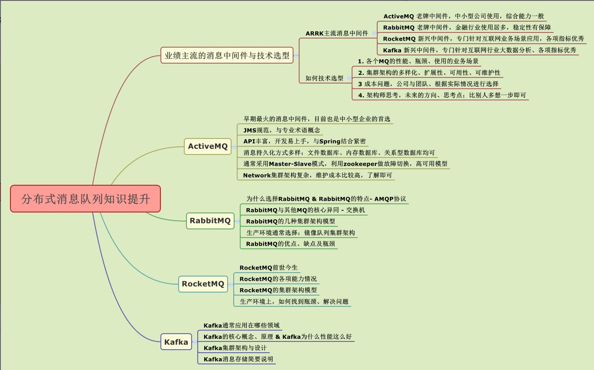

# MQ 介绍

分布式消息队列MQ应用场景：

- 服务解耦（弱依赖）
- 削峰填谷（把流量的高峰和低谷做均衡）
- 异步化缓冲（适用于某些只需要达到最终一致性的需求）

MQ 需要的关注点：

- 生产端的可靠性投递： 消息不能丢失。
- 消费端的幂等性:     避免消息重复消费多次。
- 高可用：一个MQ宕机如何保证仍然可用。
- 低延迟：巨量的流量下如何保证消息的及时性
- 可靠性：消息不丢失（一般都是副本方式）
- 堆积能力：高峰期能够堆积到什么程度
- 扩展性：是否支持无感知的横向扩容

主流MQ：

- RabbitMQ（横向扩展能力稍差，可用性可维护性很强）
- Kafka
- RocketMQ（阿里巴巴开发的，已交给Apache）

