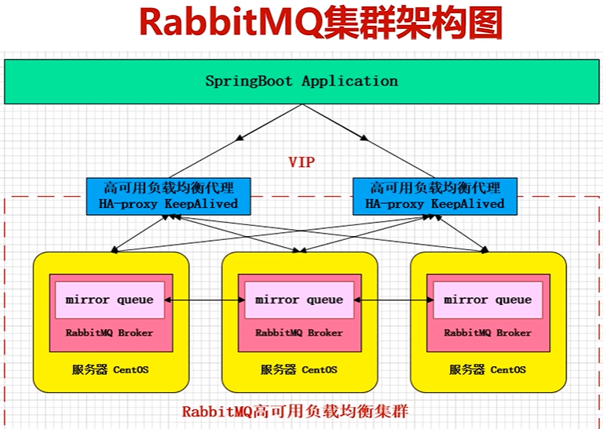
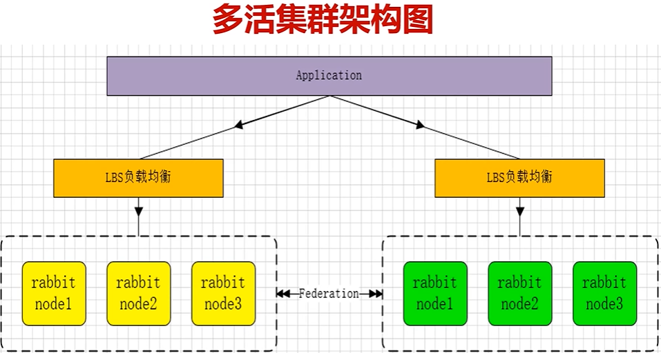
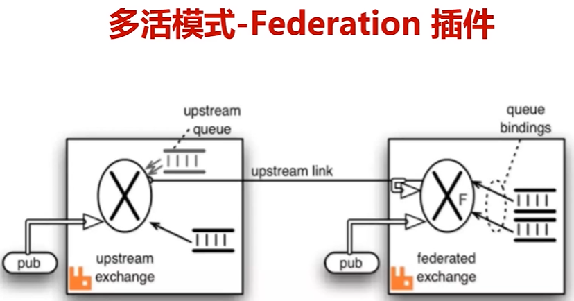
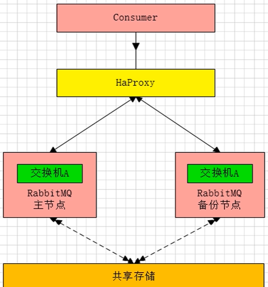
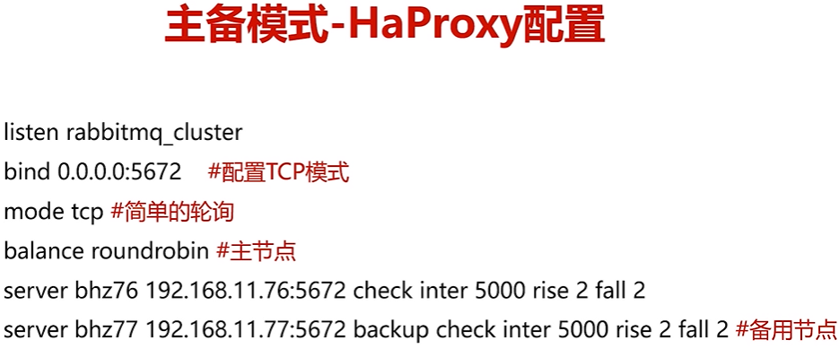
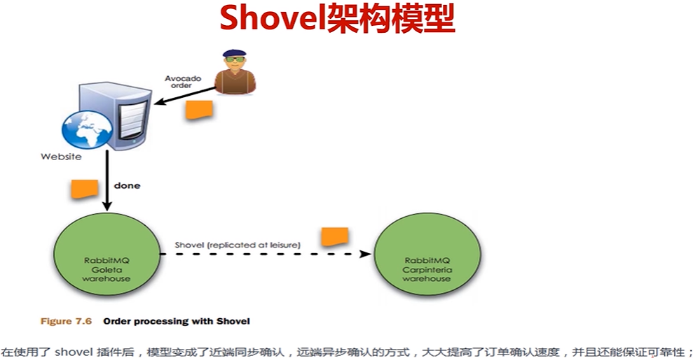
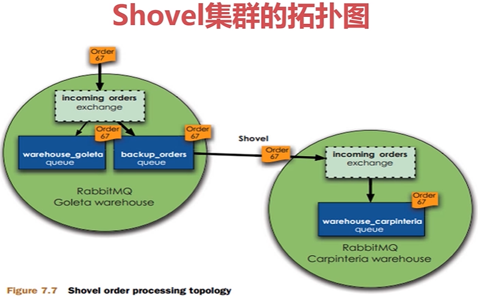
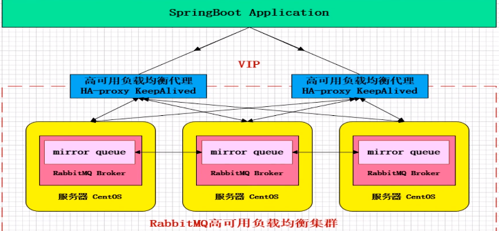

# RabbitMQ 集群架构模型与原理解析

RabbitMQ 四种集群架构

- 主备模式：热备份（master-slave），master 对外提供读写，salve作为一个备份，当出现异常的时候，master宕机，做一个切换，slave节点切换为master节点。
- 远程模式：数据异地容灾，提升性能，单个节点处理不过来，可以转移到下游的集群中（架构简单、配置复杂，不常用）
- 镜像模式：业界使用最广泛（消息可靠传递）
- 多活模式：异地容灾、数据转储，类似于远程模式

## 镜像模式（推荐）

集群模式非常经典的就是Mirror镜像模式，保证100%数据不丢失。

在实际工作中用的最多，并且实现集群非常简单，一般互联网大厂都会构建这种镜像集群模式。

Mirror镜像队列特点：

- 高可靠
- 数据同步
- 单数节点，镜像队列一般推荐3个节点。

缺陷：不支持横向扩展。当出现消息堆积时，即使横向扩展，各个节点之间因为要做数据同步，因此会占用更多的资源。如果需要横向扩容，需要采用多活模式。

## 多活模式

这种模式也是实现异地数据复制的主流模式，因为Shovel模式配置比较复杂，所以一般来说实现异地集群都是使用这种双活或者多活模型来实现的。

这种模式需要依赖RabbitMQ的federation插件，可以实现持续的可靠的AMQP数据通信，多活模式实际配置与应用非常简单。

RabbitMQ部署架构采用双中心模式（多中心），那么在两套（或多套）数据中心中各部署一套RabbitMQ集群，各中心的RabbitMQ服务除了需要为业务提供正常的消息服务外，中心之间还需要实现部分队列消息共享。

### 多活模式-Federation 插件

Federation 插件是一个不需要构建Cluster，而在Brokers之间传输消息的高性能插件，Federation插件可以在Brokers或者Cluster之间传输消息，连接的双方可以使用不同的users和virtual hosts，双方也可以使用版本不同的RabbitMQ 和 Erlang。Federation 插件使用AMQP协议通讯，可以接受不连续的传输。

Federation Exchanges，可以看成 Downstream从 Upstream主动拉取消息，但并不是拉取所有消息，必须是在Downstream上已经明确定义Bindings关系的Exchange，也就是有实际的物理Queue来接收消息，才会从UpStream拉取消息到DownStream。使用AMQP协议实施代理间通信，Downstream会将绑定关系组合在一起，绑定/解除绑定命令将发送到upstream交换机。因此，Federation Exchange只接收具有订阅的消息，本处贴出官方图来说明。

## 主备模式

warren(兔子窝)，一个主、备方案（主节点如果挂掉，从系欸但提供服务，和ActiveMQ利用Zookeeper做主/备一样）。

## 远程模式（不推荐）

该模式配置过于复杂，已经不怎么使用。

远距离通信和复制，可以实现双活的一种模式，简称Shovel模式。

所谓Shovel就是我们可以把消息进行不同数据中心的复制工作，可以跨地域的让两个mq集群互联。

## Rabbitmq 集群搭建

镜像模式：集群模式非常经典的就是Mirror镜像模式，保证100%数据不丢失，在实际工作中也是用的最多的。并且实现集群非常的简单，一般互联网大厂都会构建这种镜像集群模式。

Mirror镜像队列，目的是为了保证RabbitMQ数据的高可靠性解决方案，主要就是实现数据的同步，一般来讲是2-3个节点实现数据同步（对于100%数据可靠性解决方案一般是3个节点）集群架构如下：

详细步骤参见《RabbitMQ消息服务用户手册》。

