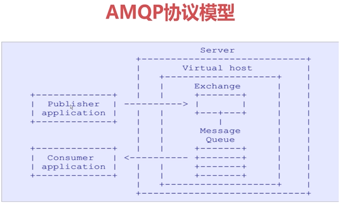
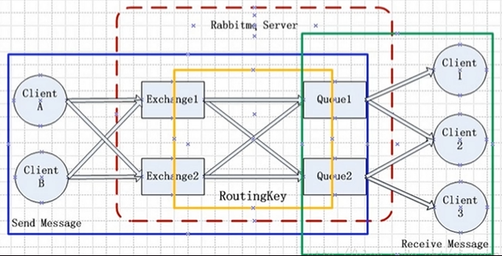
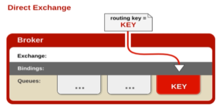
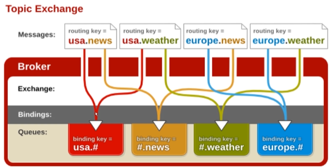
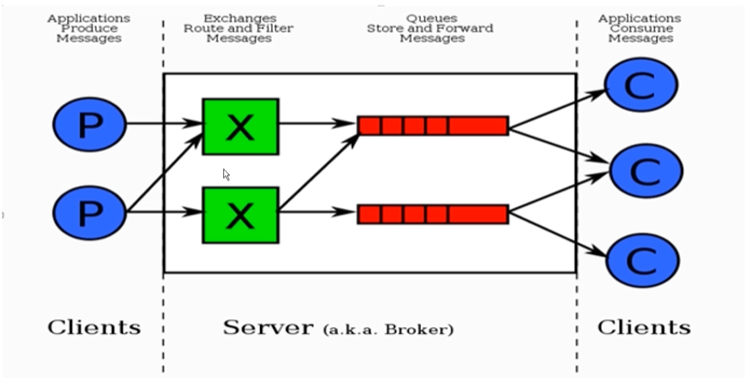
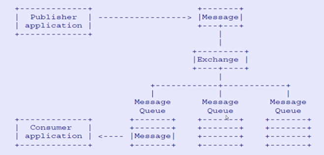

# RabbitMQ 介绍与核心概念

RabbitMQ 是一个开源的消息代理和队列中间件，用来通过普通协议在完全不同的应用之间共享数据。

RabbitMQ 是使用 Erlang 语言来编写的，基于 AMQP 协议。

## AMQP

AMQP 全称：Advanced Message Queuing Protocol，高级消息队列协议。

AMQP 定义：是具有现代特征的二进制协议。是一个提供统一消息服务的应用层标准高级消息队列协议，是应用层协议的一个开放标准，为面向消息的中间件设计。

### AMQP 核心概念

- **Server**：又称 Broker，接受客户端的连接，实现 AMQP 实体服务；
- **Connection**：连接，应用程序与 Broker 建立的网络连接；
- **Channel**：网络信道，几乎所有的操作都在 Channel 中进行，Channel 是进行消息读写的通道。客户端可以建立多个 Channel，每个 Channel 代表一个会话任务。
- **Message**：消息，服务器和应用程序之间传送的数据，由 Properties 和 Body 组成。Properties 可以对消息进行修饰，比如消息的优先级、延迟等高级特性；Body 则就是消息体内容。
- **Virtual host**：虚拟主机地址，用于进行逻辑隔离，最上层的消息路由。一个 Virtual Host 里面可以有若干个 Exchange 和 Queue，但同一个 Virtual Host 里面不能有相同名称的 Exchange 或 Queue。
- **Exchange**：交换机，接收消息，根据**路由键（routing key）**转发消息到绑定的队列。
- **Binding**：Exchange 和 Queue 之间的虚拟连接，binding 中可以包含 routing key。
- **Routing key**：一个路由规则，虚拟机可用它来确定如何路由一个特定消息。
- **Queue**：也称为 Message Queue，消息队列，保存消息并将它们转发给消费者。

## RabbitMQ 核心 API

### Exchange（交换机）

用于接收消息，并根据路由键转发消息所绑定的队列。

Exchange和Queue的绑定是通过Routing Key做路由的，RoutingKey决定了消息通过Exchange流转到哪个Queue。

Exchange 的属性有：

- Name：交换机名称。
- Type：交换机类型，可以是 direct（直接的方式）、topic（按照某种规则的方式）、fanout（类似于广播的方式）、headers（请求头的方式，很少用）、Delay  中的一种。
- Durability：是否需要持久化，true为持久化。
- Auto Delete：当最后一个绑定到Exchange上的队列删除后，自动删除该Exchange，不常用，一般不需要设置为自动删除。
- Internal：当前 Exchange 是否用于 RabbitMQ 内部使用，默认为false。一旦设置为true，外部是无法访问的。
- Arguments：扩展参数，用于扩展 AMQP 协议自制定化使用。

#### Direct Exchange

Direct模式下，所有发送到 Direct Exchange 的消息会被转发到 RouteKey 中指定的 Queue。必须对Exchange、RoutingKey、Queue三者进行显式绑定，才能够发送消息。

注意：Direct 模式可以使用 RabbitMQ 自带的 Exchange：Default Exchange，所以不需要将 Exchange 进行任何绑定（Binding）操作，消息传递时，RouteKey 必须完全匹配队列名称才能被队列接收，否则该消息会被丢弃。如果使用的不是Default Exchange，必须对Exchange、RoutingKey、Queue三者进行显式绑定，才能够发送消息。

#### Topic Exchange

所有发送到 Topic Exchange 的消息被转发到所有关心 RouteKey 中指定 Topic 的 Queue 上。

也就是说，Exchange 将 RouteKey 和某个 Topic 进行模糊匹配，此时队列需要绑定一个 Topic。

Topic Exchange 可以使用通配符进行模糊匹配：

- `#` ：匹配一个或多个词。例如：`log.#` 能够匹配到 `log.info.oa` ；
- `*` ：匹配不多不少一个词。例如：`log.*` 只会匹配到`log.erro`；

注意：虽然 Exchange 和 Queue 是多对多的关系，但在实际开发过程中，为了避免混乱，通常一种消息对应一种 RouteKey 的匹配规则，一类消息只发到一个 Exchange ，Exchange 后面再对应一个或多个 Queue。（保证Exchange 是单一的）

## RabbitMQ 整体架构图

RabbitMQ的整体架构模型：

- exchange和message queue可以是多对多的关系，但在实际开发中，一般采用一对多的关系，一个exchange对应多个queue。
- 一个queue可以被多个consume消费，但在实际开发中， 一般采用一个queue只被一个特定的consume消费。

## RabbitMQ 消息如何流转

RabbitMQ的消息流转过程：

