# RabbitMQ 介绍与核心概念

RabbitMQ 是一个开源的消息代理和队列中间件，用来通过普通协议在完全不同的应用之间共享数据。

RabbitMQ 是使用 Erlang 语言来编写的，基于 AMQP 协议。


## AMQP

AMQP 全称：Advanced Message Queuing Protocol，高级消息队列协议。

AMQP 定义：是具有现代特征的二进制协议。是一个提供统一消息服务的应用层标准高级消息队列协议，是应用层协议的一个开放标准，为面向消息的中间件设计。


### AMQP 核心概念

- **Server**：又称 Broker，接受客户端的连接，实现 AMQP 实体服务；
- **Connection**：连接，应用程序与 Broker 建立的网络连接；
- **Channel**：网络信道，几乎所有的操作都在 Channel 中进行，Channel 是进行消息读写的通道。客户端可以建立多个 Channel，每个 Channel 代表一个会话任务。
- **Message**：消息，服务器和应用程序之间传送的数据，由 Properties 和 Body 组成。Properties 可以对消息进行修饰，比如消息的优先级、延迟等高级特性；Body 则就是消息体内容。
- **Virtual host**：虚拟主机地址，用于进行逻辑隔离，最上层的消息路由。一个 Virtual Host 里面可以有若干个 Exchange 和 Queue，但同一个 Virtual Host 里面不能有相同名称的 Exchange 或 Queue。
- **Exchange**：交换机，类似于Kafka中的topic（主题）。接收消息，根据**路由键（routing key）**转发消息到绑定的队列。Exchange和Queue是多对多的关系。但实际应用中，为了降低复杂性，一般采用的是一个Queue只对应一个Exchange，但一个Exchange对应多个Queue。
- **Binding**：Exchange 和 Queue 之间的虚拟连接，binding 中可以包含 routing key。
- **Routing key**：一个路由规则，虚拟机可用它来确定如何路由一个特定消息。
- **Queue**：也称为 Message Queue，消息队列，保存消息并将它们转发给消费者。

### RabbitMQ整体架构图

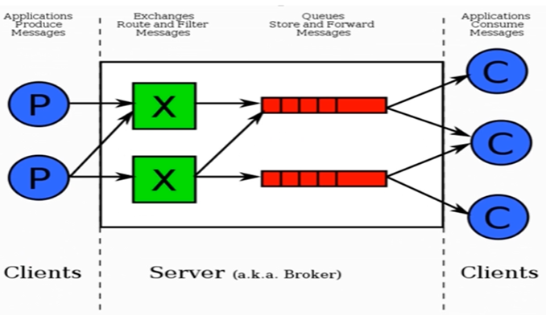

**虽然一个Consume可以消费多个Queue中的数据，但在实际工作中，一个Consume只消费一个Queue中的数据。**

- exchange和message queue可以是多对多的关系，但在实际开发中，一般采用一对多的关系，一个exchange对应多个queue。
- 一个queue可以被多个consume消费，但在实际开发中， 一般采用一个queue只被一个特定的consume消费。


### RabbitMQ消息流转示意图

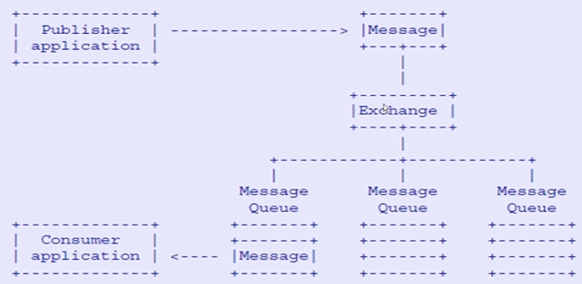


即使在编辑代码中没有显式的指明具体的Exchange，默认也是使用的是AMQP default Exchange。生产者发送的消息是往Exchange上发，而消费者是不知道Exchange的，而是只监听具体队列的。


### ACK（返回应答）

无论生产者还是消费者都有ACK的概念。

生产者与server之间的应答：

当生产者使用异步方式发送消息时，Rabbit server会返回一个应答给生产者。如果是同步方式，发送消息后Rabbit server立刻返回结果，出现问题就抛异常。

消费者与server之间的应答：

当消费者处理完一条消息之后，将通知Rabbit server，回送一个处理成功的应答。

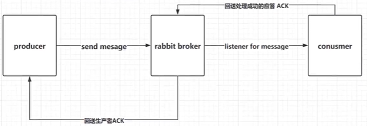

实际使用中，都会采用手工ACK，消费端消费完消息后，手动通知Rabbit server。


## RabbitMQ 核心 API

### Exchange（交换机）

用于接收消息，并根据路由键转发消息所绑定的队列。不指定交换机的名称，直接发送消息，会使用RabbitMQ默认的交换机。


Exchange和Queue的绑定是通过Routing Key做路由的，RoutingKey决定了消息通过Exchange流转到哪个Queue。

Exchange 的属性有：

- Name：交换机名称。
- Type：交换机类型，可以是 direct（直接的方式）、topic（按照某种规则的方式）、fanout（类似于广播的方式）、headers（请求头的方式，很少用）、Delay  中的一种。
- Durability：是否需要持久化，true为持久化。
- Auto Delete：当最后一个绑定到Exchange上的队列删除后，自动删除该Exchange，不常用，一般不需要设置为自动删除。
- Internal：当前 Exchange 是否用于 RabbitMQ 内部使用，默认为false。一旦设置为true，外部是无法访问的。
- Arguments：扩展参数，用于扩展 AMQP 协议自制定化使用。


#### Direct Exchange

Direct模式下，所有发送到 Direct Exchange 的消息会被转发到 RouteKey 中指定的 Queue。必须对Exchange、RoutingKey、Queue三者进行显式绑定，才能够发送消息。


注意：Direct 模式可以使用 RabbitMQ 自带的 Exchange：Default Exchange，所以不需要将 Exchange 进行任何绑定（Binding）操作，消息传递时，RouteKey 必须完全匹配队列名称才能被队列接收，否则该消息会被丢弃。如果使用的不是Default Exchange，必须对Exchange、RoutingKey、Queue三者进行显式绑定，才能够发送消息。

Direct Exchange模式下，不能使用RouteKey模糊匹配，必须完全匹配RouteKey。

#### Topic Exchange

所有发送到 Topic Exchange 的消息被转发到所有关心 RouteKey 中指定 Topic 的 Queue 上。

也就是说，Exchange 将 RouteKey 和某个 Topic 进行模糊匹配，此时队列需要绑定一个 Topic。


Topic Exchange 可以使用通配符进行模糊匹配：

- `#` ：匹配一个或多个词。例如：`log.#` 能够匹配到 `log.info.oa` ；
- `*` ：匹配不多不少一个词。例如：`log.*` 只会匹配到`log.erro`；

注意：虽然 Exchange 和 Queue 是多对多的关系，但在实际开发过程中，为了避免混乱，通常一种消息对应一种 RouteKey 的匹配规则，一类消息只发到一个 Exchange ，Exchange 后面再对应一个或多个 Queue。（保证Exchange 是单一的）


#### Fanout Exchange

不处理路由键，只需要简单的将队列绑定到交换机上。

发送到交换机的消息都会被转发到与该交换机绑定的所有队列上。类似于广播的形式，例如：fanout发送10条消息，两个consumer各自收到5条？

Fanout交换机转发消息是最快的。不需要做路由，所以发消息最快。


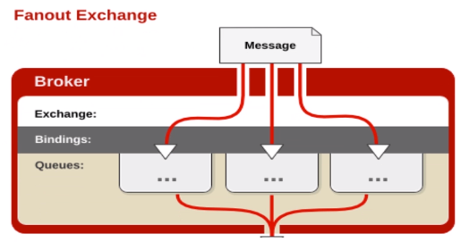


### Binding（绑定）

绑定的关系主要有：

- Exchange和Exchange之间的连接关系（不推荐使用）
- Exchange和Queue之间的连接关系

Binding中可以包含RoutingKey或者参数。


### Queue（消息队列）

消息队列，实际存储消息数据的载体。

常用的属性：

- Durability：是否持久化。值为Durable表示是，值为Transient表示否。
- Auto delete：若选 Yes，表示当最后一个监听被移除之后，该Queue会自动被删除。


### Message（消息）

服务器和应用程序之间传送的数据。

本质上就是一段数据，由Properties 和 Payload（Body）组成。

常用属性：

- delivery mode：1表示非持久化，2表示持久化。
- headers：自定义属性
- content_type
- content_encoding
- priority
- **correlation_id**：唯一标记（幂等性）
- reply_to
- **expiration**：过期时间
- message_id
- timestamp
- type
- user_id
- app_id
- cluster_id


### Virtual host（虚拟主机）

虚拟地址，用于进行逻辑隔离，最上层的消息路由。

一个 Virtual Host里面可以有若干个 Exchange 和 Queue。

同一个Virtual Host 里面不能有相同名称的Exchange或 Queue。


## RabbitMQ 高级特性

### 消息如何保障 100% 的投递成功

生产端的可靠性投递包括：

- 保障消息的成功发出
- 保障MQ节点的成功接收
- 发送端收到MQ节点（Broker）确认应答（生产端ACK）
- 完善的消息补偿机制

互联网大厂的解决方案：**消息信息落库，对消息状态进行打标**

消息要存入DB，并记录状态标记。收到各个节点返回的ACK 要去更新消息的状态标记，如果消息状态一直没被更新的，就要用一个定时任务去扫这些消息记录，然后做重发。

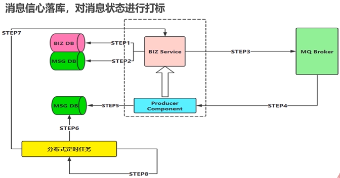

biz db业务db，msg db日志db，broker异步发送ack给业务端，通过producer componet监听ack，收到后更新msg db。如果一直没有收到ack通过定时任务重发消息。

### 幂等性概念

可以借鉴数据库的乐观锁机制，例如对DB中记录加version 字段，只有当version 为某个值的时候才可以被查找到 去进行修改，并且 修改后 要更新version的值。

比如执行一条更新库存的SQL语句：

```sql
update something set count=count-1, version = version + 1 where version =1
```

### 如何避免消息的重复消费问题

唯一的解决方案就是消费端自己做幂等性校验。

消费端实现幂等性，就意味着我们的消息永远不会消费多次，即使我们收到了多条一样的消息。

业界主流的幂等性操作：

- 业务唯一ID（或），利用数据库主键去重。

就是消息要有唯一ID，被操作过后要以这个ID为主键（目的是，避免多条相同消息同时进来，要存入DB，但是主键要求是唯一的，所以就存不了）存入DB中，新的消息来了，先去DB中以新消息的ID查，看DB中有没有，如果有的话，就不操作。


### 生产端Confirm确认消息

#### Confirm消息确认机制

消息的确认，是指生产者投递消息后，如果Broker收到消息，则会给我们生产者一个应答。这个过程是一个异步的过程。

生产者进行接收应答，用来确定这条消息是否正常的发送到Broker，这种方式也是消息的可靠性传递和核心保障。

确认机制流程图：

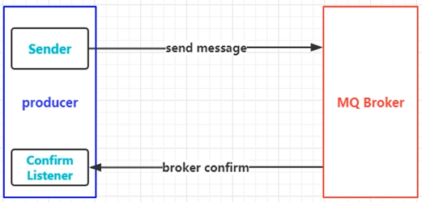

#### 如何实现Confirm确认消息

- 第一步：在channel上开启确认模式：channel.confirmSelect()
- 第二步：在channel上添加监听：addConfirmListener，监听成功和失败的返回结果，根据具体的结果对消息进行重新发送、或记录日志等后续处理。

生产端Java代码示例：

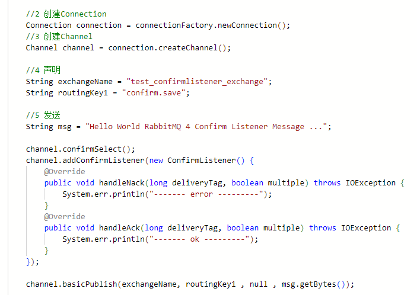

### 生产端Return返回消息

Return Listener 用于处理一些不可路由的消息。即路由找不到的情况下，才会使用Return Listener。

消息生产者通过指定一个Exchange和RoutingKey，把消息送达到某一个队列中去，然后我们的消费者监听队列，进行消费处理操作。

但是在某些情况下，如果我们在发送消息的时候，当前的Exchange不存在或者指定的RouteKey路由不到，这个时候如果我们需要监听这种不可达的消息，就要使用Return Listener。

在基础API中有一个关键的配置项：Mandatory。如果为true，则监听器会接收到路由不可达的消息，然后进行后续处理，如果为false，那么Broker端自动删除该消息。

Return消息机制流程图：

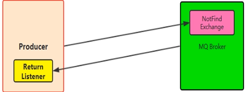

生产端Java示例代码：

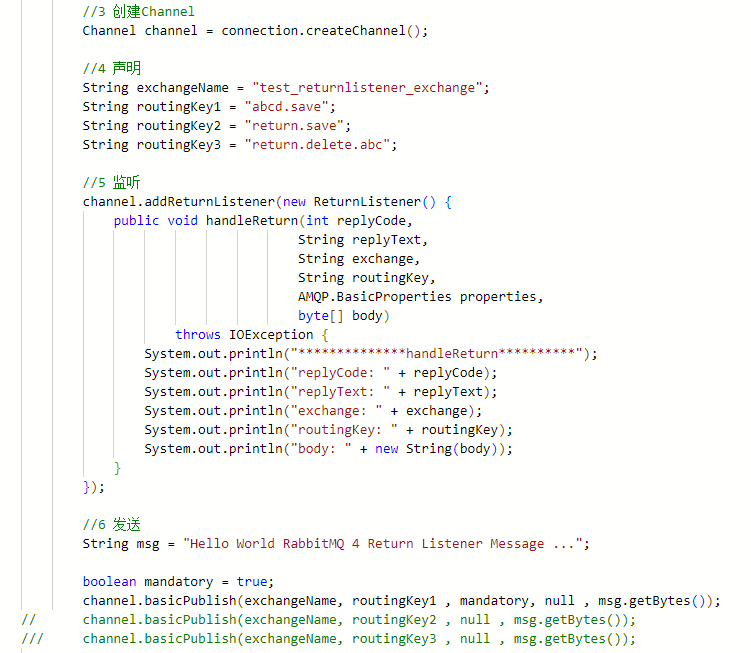


### 消息的ACK与重回队列

#### 消费端ACK

手工ACK分为：ACK和NACK。

ACK：这条消息消费端处理完了，给Broker回一个应答，告诉它处理完了。

NACK：消费端即使处理失败了，也会告诉Broker，处理失败了。

消费端进行消费的时候，如果由于业务异常我们可以进行日志的记录，然后进行补偿。此时可以选择NACK。（消费失败了回NACK就好了，不要做重回队列）。

如果由于服务器宕机等严重问题，那我们就需要手工进行ACK，保障消费端消费成功。

在工作中，基本不会选择自动ACK，都会选择手工ACK：成功消费的时候，选择ACK，消费失败的时候，选择NACK。

#### 消费端的重回队列（不推荐使用）

消费端重回队列是为了对没有处理成功的消息，把消息重新会递给Broker。

局限性：如果一个消费端持续性的处理失败，就会导致无限的重复性的多次重回队列，可能会无限死循环，会影响性能。

在实际应用中，一般都会关闭重回队列，也就是设置为false。

消费端Java代码示例：

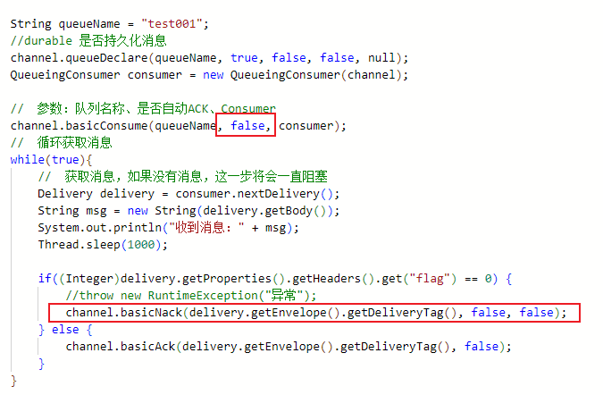

注意：上述代码中的basicNack中的参数requeue表示是否重回队列，请谨慎使用。

### 消息的限流

消费端限流

假设一个场景，首先，我们RabbitMQ服务器有上万条未处理的消息，我们随便打开一个消费者客户端，会出现下面情况：

- 巨量的消息瞬间全部推送过来，但是我们单个客户端无法同时处理这么多数据。

RabbitMQ提供了一种qos（服务质量保证）功能，即在非自动确认消息的前提下，如果一定数目的消息（通过基于Consume或者channel设置Qos的值）未被确认前，不进行消费新的消息。

```c#
void BasicQos(uint prefetchSize, ushort prefetchCount, bool global);
```

prefetchSize：报文大小，默认0

prefetchCount：会告诉RabbitMQ不要同时给一个消费者推送多于N个消息，即一旦有N个消息还没有ack，则该consumer将Block掉，直到有消息ack。

global：true/false 是否将上面设置应用于channel。简单来说，就是上面限制是channel级别的还是consumer级别。如果为true，这个channel下面的所有消费者都有这个设置，如果为false，则针对某个消费者了。

注意：

- prefetchSize和global这两项，RabbitMQ没有实现，暂且不研究。
- prefetch_count只在no_ack=false的情况下生效，即在自动应答的情况下这两个值是不生效的。

消费端Java示例代码：

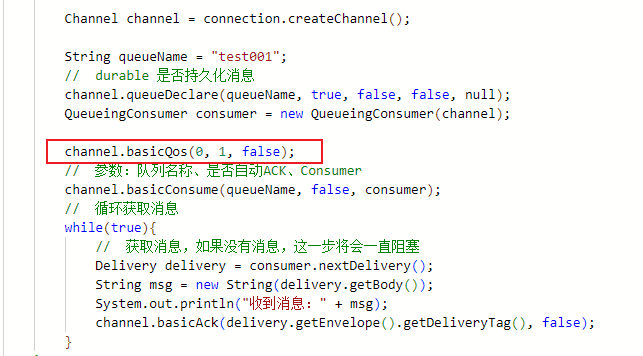


### TTL队列/消息

TTL是Time To Live的缩写，也就是生存时间。

RabbitMQ支持消息的过期时间，在消息发送时可以进行指定。

RabbitMQ支持队列的过期时间，从消息入队列开始计算，只要超过了队列的超时时间配置，那么消息会自动的清除。


### 死信队列

DLX，Dead-Letter-Exchange

利用DLX，当消息在一个队列中变成死信（dead message）之后，它能被重新publish到另一个Exchange，这个Exchange就是DLX。

消息变成死信的几种情况：

- 消息被拒绝（basic.reject / basic.nack） 并且 requeue = false（不重回队列）
- 消息TTL过期
- 队列达到消息数量最大条数或消息内容达到最大长度。

DLX也是一个正常的Exchange，和一遍的Exchange没有区别，它能在任何队列上被指定，实际上就是一个属性在控制。

当队列中有死信时，RabbitMQ就会自动的将这个消息重新发布到设置的Exchange上，进而被路由到另一个队列。

可以监听这个队列中消息做相应的处理，这个特性可以弥补rabbitMQ3.0以前的immediate参数功能。

#### 死信队列的设置

首先需要设置死信队列的Exchange和Queue，然后进行正常声明Exchange、Queue、绑定，只不过我们需要在队列加上一个参数即可：

```java
arguments.put("x-dead-letter-exchange","dlx.exchange");
```

上述指定Exchange的名称为“dlx.exchange”。设置好之后，当消息过期、requeue、队列达到最大长度时，就可以直接路由到死信队列。

生产端Java示例代码：

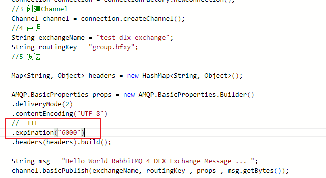

上述指定消息过期时间为6秒，6秒如果没有消费就过期。

消费端Java示例代码：

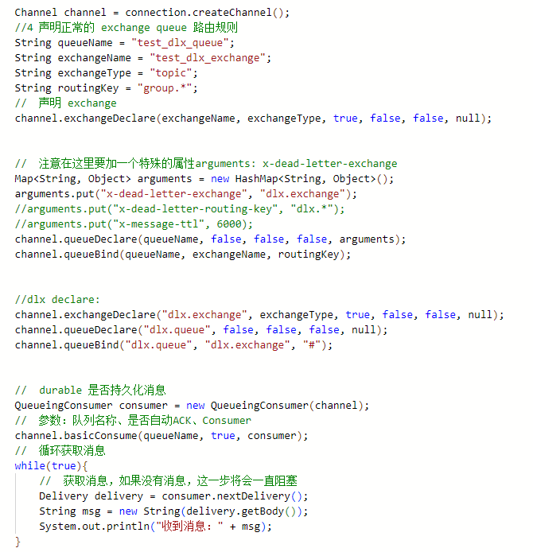

rabbitmq支持事务，但是不要使用，性能太差。


