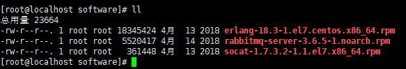
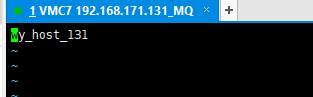
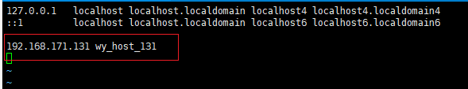
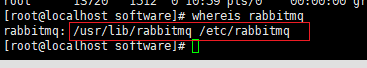
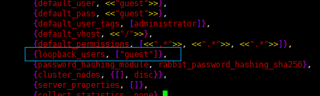
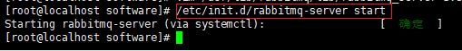
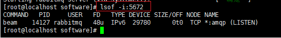
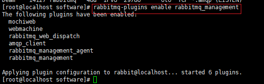
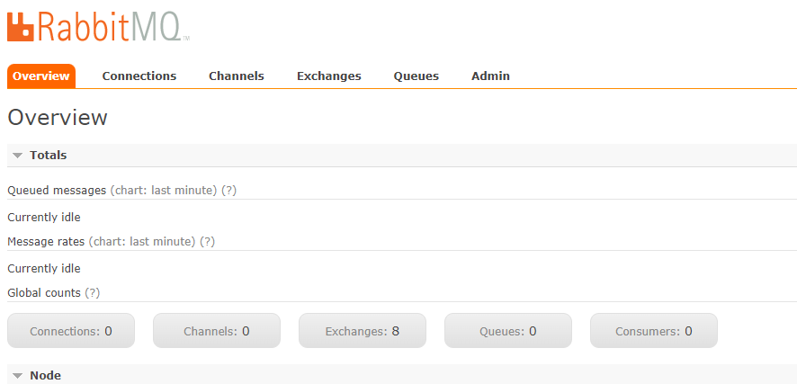

# RabbitMQ的安装和配置


## 安装与初始化配置

### 下载RabbitMQ相关软件包

- rabbitmq-server 包，推荐使用RabbitMQ 3.6.5 版本
- erlang包，rabbitmq基于erlang构成。
- socat包，加密密钥相关的。

可以使用下述命令在线下载：

```shell
wget www.rabbitmq.com/releases/erlang/erlang-18.3-1.el7.centos.x86_64.rpm
wget http://repo.iotti.biz/CentOS/7/x86_64/socat-1.7.3.2-1.1.el7.lux.x86_64.rpm
wget www.rabbitmq.com/releases/rabbitmq-server/v3.6.5/rabbitmq-server-3.6.5-1.noarch.rpm
```

也可以本地下载完成之后，上传到/home/software/ 目录下。



### 安装RabbitMQ

安装RabbitMQ之前，需要安装一些其他插件：

```shell
yum install build-essential openssl openssl-devel unixODBC unixODBC-devel make gcc gcc-c++ kernel-devel m4 ncurses-devel tk tc xz
```

配置好主机名称：

分别在 /etc/hosts 文件和 /etc/hostname 文件中，指定主机名称。

vim /etc/hostname文件内容：



vim /etc/hosts文件内容：



依次使用如下命令安装软件，注意先后顺序：

```
rpm -ivh erlang-18.3-1.el7.centos.x86_64.rpm 
rpm -ivh socat-1.7.3.2-1.1.el7.x86_64.rpm
rpm -ivh rabbitmq-server-3.6.5-1.noarch.rpm
```

注意：使用rpm命令安装时，会以固定的目录进行安装，即会安装在特定的目录下。



### 配置RabbitMQ

安装之后，需要进行如下配置。

由于使用的是rpm的方式安装的软件，因此配置文件是以.app作为后缀的。

- 修改用户登录与连接心跳检测：

  ```shell
  vim /usr/lib/rabbitmq/lib/rabbitmq_server-3.6.5/ebin/rabbit.app
  ```

  设置loopback_users的值如下图所示（去掉两个尖括号，只保留guest），用于用户登录：

  

配置完成之后，保存并退出。


## 启动RabbitMQ服务

```
/etc/init.d/rabbitmq-server start
```



- 启动服务：`/etc/init.d/rabbitmq-server start`
- 停止服务：`/etc/init.d/rabbitmq-server stop `
- 查看状态：`/etc/init.d/rabbitmq-server status `
- 重启服务：`/etc/init.d/rabbitmq-server restart`


## 安装管理插件

注意：必须启动了RabbitMQ服务之后，才能安装管理插件。

### 查看服务有没有启动

```shell
lsof -i:5672
```

5672是Rabbit服务的默认端口。



Rabbit服务启动后，就可以安装管理插件了。

### 安装控制台管理插件

```
rabbitmq-plugins enable rabbitmq_management
```



安装完成之后，可以查看管理端口有没有启动：

```
lsof -i:15672 
```

或者：

```
netstat -tnlp | grep 15672
```

15672是管理端控制台端口。

### 访问控制台管理界面

浏览器访问15672端口链接：http://192.168.171.131:15672/

 用户名和密码均是 guest，登录之后，即可进入到RabbitMQ管理界面：




## 附： Docker安装RabbitMQ

```shell
docker run -d -it --rm --name rabbitmq -p 5672:5672 -p 15672:15672 rabbitmq:3-management
```

安装完成之后，可以通过浏览器访问对应的15672端口打开RabbitMQ的管理界面，默认用户名和密码都为guest。

