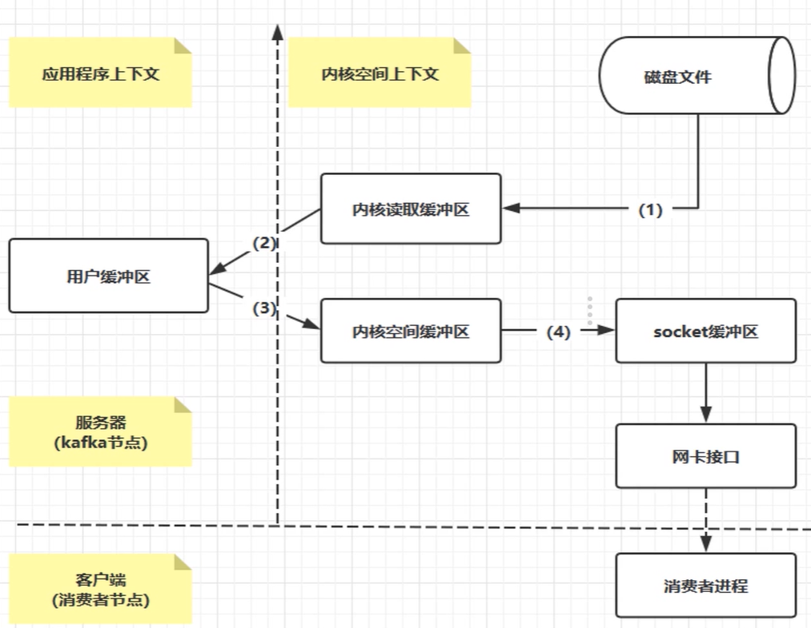
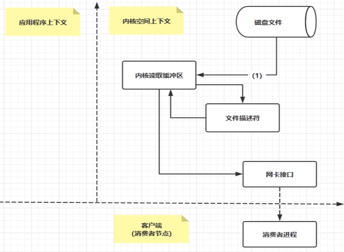

# Kafka 介绍与高性能原因分析

## Kafka 介绍

Kafka是 LinkedIn开源的分布式消息系统，目前归属于Apache顶级项目。

Kafka主要特点是基于Pull模式来处理消息消费，追求高吞吐量，一开始的目的就是用于日志收集和传输。

0.8版本开始支持复制，不支持事务，对消息的重复、丢失、错误没有严格要求，适合产生大量数据的互联网服务的数据收集业务。

### kafka 的特点

- 分布式的特性，支持消息分区。
- 跨平台，支持多种语言客户端。
- 实时性，消息堆积也不会影响Kafka性能。
- 伸缩性，支持水平扩展。

## kafka 高性能的原因

- 顺序写：顺序写盘的过程，可以提高磁盘的利用率。consumer顺序消费数据，但是不从盘中删除数据，避免随机写盘。一般MQ的设计都不允许删除，而是通过打标记的方式实现。阿里云支持rocket删除某条消息，有可能进行的是打标记转储的方式，而不是物理删除。

- Page Cache（空中接力，高效读写）：建立于Linux内核Page Cache，不显式使用内存。

  producer生产消息时，会使用pwrite()系统调用按偏移量写入数据，并且都会先写入page cache里。

  consumer消费消息时，会使用sendfile()系统调用，零拷贝地将数据从page cache传输到broker的Socket buffer，再通过网络传输。同时，page cache中的数据会随着内核中flusher线程的调度以及对sync()/fsync()的调用写回到磁盘，就算进程崩溃，也不用担心数据丢失。

  如果consumer要消费的消息不在page cache里，才会去磁盘读取，并且会顺便预读出一些相邻的块放入page cache，以方便下一次读取。

  重要的结论：如果Kafka producer的生产速率与consumer的消费速率相差不大，那么就能几乎只靠对broker page cache的读写完成整个生产-消费过程，磁盘访问非常少。这个结论俗称为“读写空中接力”。 

-    

- 高性能、高吞吐

- 后台异步、主动Flush

- 预读策略、IO调度

### kafka高性能核心pageCache与zeroCopy原理解析

pageCache：是操作系统实现的一种主要的磁盘缓存，以此减少对磁盘的IO操作。具体来说，就是把磁盘中的数据缓存到内存中，把对磁盘的访问变成为对内存的访问。

读文件：当一个进程准备读取磁盘文件内容，操作系统首先做检查，将待读取的数据所在的页在pagecache是否存在，如果存在，直接返回，如果没有命中，则向读取磁盘，读取的数据加入到缓存中，再返回给用户。

写文件：首先检查数据对应的页是否存在缓存页，如不存在，首先添加页，把数据添加到页，被修改的页被称为脏页，操作系统会在合适的时机把脏页写到磁盘。

传统正常文件读取写给另外一端的过程，一共有4次copy：

Kafka 读取文件到另一端的过程，只做一次copy，所以比一般的文件读取要快，这种技术也叫zerocopy，直接把页面缓存发送给用户：

