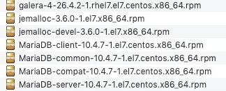

# CentOS7 安装 MariaDB 10.4.x

参考链接：

- https://www.cnblogs.com/leechenxiang/p/7095564.html
- https://mariadb.com/kb/en/mariadb-installation-version-10121-via-rpms-on-centos-7/


可以先执行第三步，再进行安装。


## 第一步：下载离线安装包

由于在线安装下载特别缓慢，建议使用离线下载再安装的形式。

下载地址：http://yum.mariadb.org/10.4/centos7-amd64/rpms/

在上述下载地址页面，搜索下图中的各个组件包，进行下载。




## 第二步：按顺序安装依赖环境包

```
yum install rsync nmap lsof perl-DBI nc
```

```
rpm -ivh jemalloc-3.6.0-1.el7.x86_64.rpm
```

```
rpm -ivh jemalloc-devel-3.6.0-1.el7.x86_64.rpm
```


## 第三步：卸载冲突的 mariadb-libs

在安装的过程中，可能会出现冲突。

先搜索：

```
rpm -qa | grep mariadb-libs
```

后删除：

```
rpm -ev --nodeps mariadb-libs-5.5.60-1.el7_5.x86_64
```


## 第四步：安装 boost-devel 依赖环境

```
yum install boost-devel.x86_64
```


## 第五步：导入MariaDB的key

```
rpm --import http://yum.mariadb.org/RPM-GPG-KEY-MariaDB
```


## 第六步：安装 galera 环境

```
rpm -ivh galera-4-26.4.2-1.rhel7.el7.centos.x86_64.rpm
```


## 第七步：安装 libaio (此步骤在安装 10.4.8 的时候需要)

```
wget http://mirror.centos.org/centos/6/os/x86_64/Packages/libaio-0.3.107-10.el6.x86_64.rpm
rpm -ivh libaio-0.3.107-10.el6.x86_64.rpm
```


## 第八步：安装MariaDB的4个核心包

```
rpm -ivh 
MariaDB-common-10.4.7-1.el7.centos.x86_64.rpm 
MariaDB-compat-10.4.7-1.el7.centos.x86_64.rpm 
MariaDB-client-10.4.7-1.el7.centos.x86_64.rpm 
MariaDB-server-10.4.7-1.el7.centos.x86_64.rpm 
```


## 第九步：配置数据库

安装完毕MariaDB后还没完，还需要配置数据库，在命令行中执行如下代码用以启动mysql服务（MariaDB就是mysql的分支，所以服务名是一样的，如果本地有mysql可以无缝切换或安装）：

```
service mysql start
```

启动成功后运行如下命令进行安全配置：

```
mysql_secure_installation
```

```
1.输入当前密码，初次安装后是没有密码的，直接回车
2.询问是否使用`unix_socket`进行身份验证：n
3.为root设置密码：y
4.输入root的新密码：root
5.确认输入root的新密码：root
6.是否移除匿名用户，这个随意，建议删除：y
7.拒绝用户远程登录，这个建议开启：n
8.删除test库，可以保留：n
9.重新加载权限表：y
```

当看到 “Thanks for using MariaDB!” 这句话，表明配置成功。


## 第十步：设置远程连接配置

要想远程连接还需要额外的配置，进入MariaDB的控制台:

- 输入密码

  ```
  mysql -u root -p 
  ```

- 赋予root用户远程连接权限

  ```
  grant all privileges on *.* to 'root'@'%' identified by 'root密码';
  flush privileges;
  ```

  配置权限后，可以使用远程客户端连接数据库服务了！