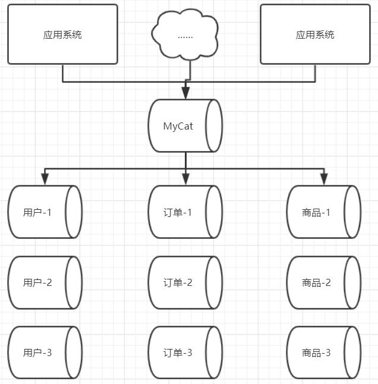

# MyCat与术语介绍

## MyCat 简介

- 开源的分布式数据库系统、数据库（MySQL、Sqlserver、MongoDB）代理工具；
- 核心功能是分库分表，即将一个大表**水平切分**成N个小表，然后存放在后端的MySQL数据库中；
- MyCat本身不存储数据，数据都是存储在MyCat后面连接的MySQL上的，数据的可靠性和事务也都是由MySQL保证的。
- 使用同传统数据库一样，支持标准SQL语句；可以用连接MySQL的方式连接MyCat；
- 不仅可以用作读写分离、分库分表，还可以用于容灾备份，云平台建设等。

## MyCat 应用场景

- 单纯的读写分离，此时配置最为简单，支持读写分离，主从切换；
- 分库分表，对于超过1000w的表进行分片，最大支持1000亿的数据；
- 多租户应用，每个应用一个数据库，应用只连接MyCat，程序本身不需要改造；
- 代替HBase，分析大数据

## MyCat 术语概念

### 逻辑库（Schema）

按照逻辑拆分出来的一个或多个数据库构成的集群，称为逻辑库。例如上图中的用户库，订单库，商品库，这3个库可以理解为是做了垂直切分而产生的，这三个库就被称为逻辑库。

### 逻辑表（table）

读写数据的表就是逻辑表。而逻辑表中的数据，则是被水平切分后，分布在不同的分片库中。

进行数据水平切分的表，称为**分片表**；而数据量较小，没有进行分片的表，称为**非分片表**。

通过数据冗余方式复制到所有的分片库中的表，叫做**全局表**，例如基础数据表或者字典表。

### 分片节点（dataNode）

数据被切分后，一张大表被分到不同的分片数据库上面，每个分片表所在的数据库就叫做分片节点。

### 节点主机（dataHost）

数据切分后，每一个分片节点不一定都会占用一个真正的物理主机，会存在多个分片节点在同一个物理主机上的情况，这些分片节点所在的主机就叫做 节点主机 。

为了避免单节点并发数的限制，尽量将读写压力高的分片节点放在不同的节点主机上。

### 分片规则（rule）

如何将一个大表拆分成多个分片表，所定的拆分规则就是分片规则。

### 全局序列号（sequence）

用于保证数据唯一标识的机制，叫做全局序列号。（数据全局唯一）

