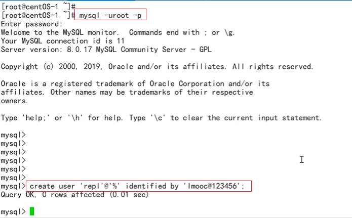
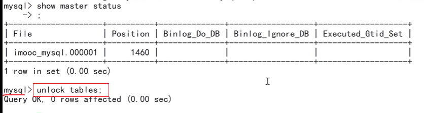

# MySQL 主从配置

配置前的数据库说明：

- 192.168.73.131：主节点。
- 192.168.73.130：从节点。
- MySQL版本：8.0+


## 主节点的配置

在主节点服务器上编辑 /etc/my.cnf 文件：

- 配置log-bin，指定MySQL的bin-log的名称；配置server-id，MySQL实例中全局唯一，并且大于0，这里设置为1：

  

  配置完成之后，需要重启mysql：

  ```
  service mysqld restart
  ```

- 创建备份账号并授权 REPLICATION SLAVE，用于主从之间的数据同步：

  

  上图中创建用户名是repl，密码是“imooc@123456"的用户，注意：这里使用的MySQL8新的加密方式。

  创建完用户之后，对账户进行授权，授权完成之后，刷新权限：

  

- 对主节点进行锁表操作，第一次同步时，只要先锁住主节点的数据，才能够将数据备份到从表。只需要执行`FLUSH TABLES WITH READ LOCK` 命令即可：

  

  一旦锁表之后，此时再往主节点写入任何数据都将被阻塞。

- 在主节点上查看log-bin的文件名和位置，执行`SHOW MASTER STATUS`命令即可：

  

  这些内容在从节点中都会用到。从节点将会从上述的Position位置开始读取日志并同步数据，这个位置之前的数据，需要手工进行同步。

- 备份主节点的数据库数据，注意要始终保持MySQL终端继续运行，同时复制一个新的SSH会话，在Linux终端执行下述命令：

  

  执行上述命令的时候，不能在MySQL终端中执行，同时由于之前已经处于锁表状态，==不能直接退出当前的MySQL终端，一旦退出，锁表命令会自动释放，就无法锁住表==。因此，需要重新打开一个SSH会话终端，而不是退出原来的终端。

  上述命令会将数据备份成dbdump.db文件。

- 复制备份文件到从节点上，可以使用scp命令。

  注意：这里是先登录到从节点，再由从节点发起scp命令，将131主节点的文件复制到从节点上的。

  

- 当备份完数据之后，就可以释放锁表操作了。

  注意：此操作是在MySQL终端上进行的。

  

- 

## 从节点的配置：

在从节点服务器上编辑/etc/my.cnf文件：

- 配置server-id，MySQL实例中全局唯一，值不能和主节点的server-id相同：

  

  配置完成之后，需要重启Mysql：

  ```
  service mysqld restart
  ```

- 还原主节点发送过来的备份数据：

  

  还原完成之后，就可以在主节点上执行释放锁的操作了。

- 在从节点上设置主从同步，需要在Mysql终端中执行下述命令：

  

  - master_host：MySQL主节点的地址；
  - master_port：MySQL主节点的端口号（数值类型），不指定会使用默认端口号；
  - master_user：备份账户的用户名；
  - master_password：备份账户的密码；
  - master_log_file ：bin-log的文件名；
  - master_log_pos：bin-log的位置（数值类型）； 是主节点执行了`show master status`语句之后得到的信息（见主节点相关配置）。

- 在从节点上执行 `start slave`，开始同步数据：

  

- 查看从节点的MySQL状态：

  ```mysql
  show slave status;
  ```

  