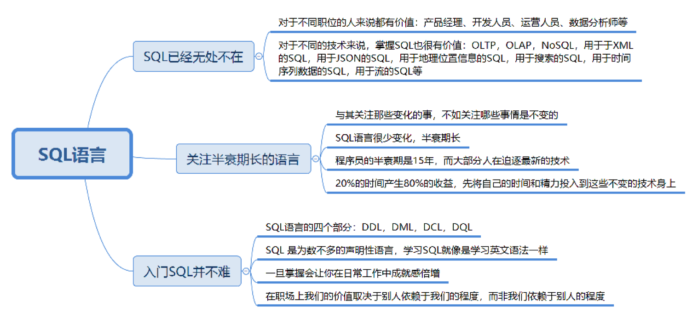
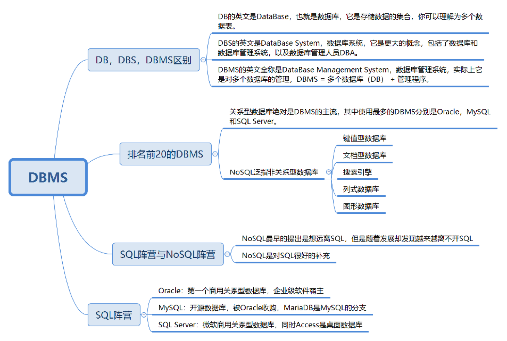
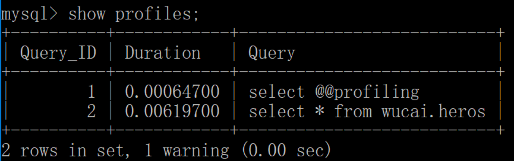
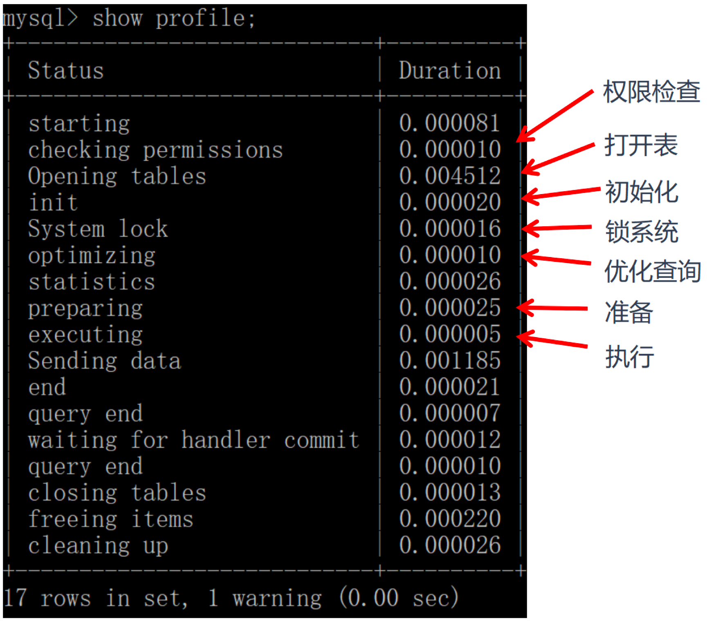
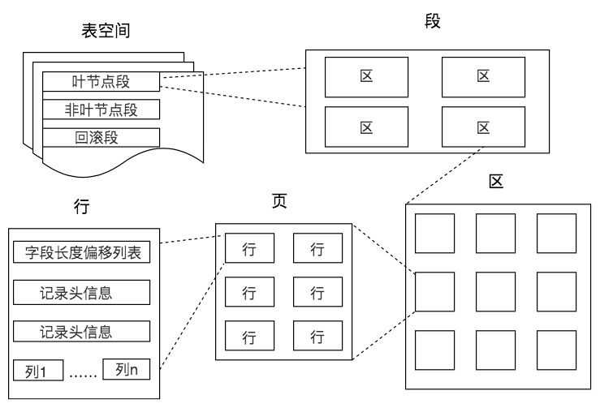

# SQL基础


## SQL按照功能划分

- DDL（Data Definition Language）：数据定义语言，用于定义数据库对象、包括数据库、表、列等。可以用来修改表结构。
- DML（Data Manipulation Language）：数据操作语言，用于操作和数据库相关的记录，比如增加、删除、修改数据表中的记录。
- DCL（Data Control Language）：数据控制语言，用于定义访问权限和安全级别。
- DQL（Data Query Language）：数据查询语言，用于查询数据。

数据库管理系统，DataBase Management System，简称DBMS。一般采用的是 ER 图（Entity Relationship Diagram），即实体 - 关系图的方式进行设计。




## DB、DBS 和 DBMS 的区别

- DB 的英文是 DataBase，也就是数据库。数据库是存储数据的集合，你可以把它理解为多个数据表。
- DBS 的英文是 DataBase System，数据库系统。它是更大的概念，包括了数据库、数据库管理系统以及数据库管理人员 DBA。
- DBMS 的英文全称是 DataBase Management System，数据库管理系统，实际上它可以对多个数据库进行管理，所以你可以理解为 DBMS = 多个数据库（DB） + 管理程序。




## SQL 在 Oracle 中的执行过程


1. 语法检查：检查 SQL 拼写是否正确，如果不正确，Oracle 会报语法错误。
2. 语义检查：检查 SQL 中的访问对象是否存在，比如列名。语法检查和语义检查的作用是保证 SQL 语句没有错误。
3. 权限检查：看用户是否具备访问该数据的权限。
4. 共享池检查：共享池（Shared Pool）是一块内存池，包括了库缓存，数据字典缓冲区等。库缓存最主要的作用是缓存 SQL 语句和该语句的执行计划。而数据字典缓冲区存储的是 Oracle 中的对象定义，比如表、视图、索引等对象。当对 SQL 语句进行解析的时候，如果需要相关的数据，会从数据字典缓冲区中提取。Oracle 通过检查共享池是否存在 SQL 语句的执行计划，来判断进行软解析，还是硬解析。
   - 在共享池中，Oracle 首先对 SQL 语句进行 Hash 运算，然后根据 Hash 值在库缓存（Library Cache）中查找，如果存在 SQL 语句的执行计划，就直接拿来执行，直接进入“执行器”的环节，这就是软解析。
   - 如果没有找到 SQL 语句和执行计划，Oracle 就需要创建解析树进行解析，生成执行计划，进入“优化器”这个步骤，这就是硬解析。
5. 优化器：优化器中就是要进行硬解析，也就是决定怎么做，比如创建解析树，生成执行计划。
6. 执行器：当有了解析树和执行计划之后，就知道了 SQL 该怎么被执行，这样就可以在执行器中执行语句了。


## MySQL 中的 SQL 是如何执行的

MySQL 是典型的 C/S 架构，即 Client/Server 架构，服务器端程序使用的 mysqld。


MySQL 由三层组成：

1. 连接层：客户端和服务器端建立连接，客户端发送 SQL 至服务器端；
2. SQL 层：对 SQL 语句进行查询处理；
3. 存储引擎层：与数据库文件打交道，负责数据的存储和读取。

其中 SQL 层与数据库文件的存储方式无关，我们来看下 SQL 层的结构：


1. 查询缓存：Server 如果在查询缓存中发现了这条 SQL 语句，就会直接将结果返回给客户端；如果没有，就进入到解析器阶段。需要说明的是，因为查询缓存往往效率不高，所以在 MySQL8.0 之后就抛弃了这个功能。
2. 解析器：在解析器中对 SQL 语句进行语法分析、语义分析。
3. 优化器：在优化器中会确定 SQL 语句的执行路径，比如是根据全表检索，还是根据索引来检索等。
4. 执行器：在执行之前需要判断该用户是否具备权限，如果具备权限就执行 SQL 查询并返回结果。在 MySQL8.0 以下的版本，如果设置了查询缓存，这时会将查询结果进行缓存。

SQL 语句在 MySQL 中的流程是：SQL 语句→缓存查询→解析器→优化器→执行器。

与 Oracle 不同的是，MySQL 的存储引擎采用了插件的形式，每个存储引擎都面向一种特定的数据库应用环境。

MySQL 还允许开发人员设置自己的存储引擎，下面是一些常见的存储引擎：

1. InnoDB 存储引擎：它是 MySQL 5.5 版本之后默认的存储引擎，最大的特点是支持事务、行级锁定、外键约束等。
2. MyISAM 存储引擎：在 MySQL 5.5 版本之前是默认的存储引擎，不支持事务，也不支持外键，最大的特点是速度快，占用资源少。
3. Memory 存储引擎：使用系统内存作为存储介质，以便得到更快的响应速度。不过如果 mysqld 进程崩溃，则会导致所有的数据丢失，因此我们只有当数据是临时的情况下才使用 Memory 存储引擎。
4. NDB 存储引擎：也叫做 NDB Cluster 存储引擎，主要用于 MySQL Cluster 分布式集群环境，类似于 Oracle 的 RAC 集群。
5. Archive 存储引擎：它有很好的压缩机制，用于文件归档，在请求写入时会进行压缩，所以也经常用来做仓库。

注意：在 MySQL 中每个表的设计都可以采用不同的存储引擎，我们可以根据实际的数据处理需要来选择存储引擎，这也是 MySQL 的强大之处。


## 如何在 MySQL 中对一条 SQL 语句的执行时间进行分析

1. 首先我们需要看下 profiling 是否开启，开启它可以让 MySQL 收集在 SQL 执行时所使用的资源情况。

   ```sql
   mysql> select @@profiling;
   ```

2. profiling=0 代表关闭，我们需要把 profiling 打开，即设置为 1：

   ```sql
   mysql> set profiling=1;
   ```

3. 执行任何一个 SQL 查询。

   ```sql
   mysql> select * from wucai.heros;
   ```

4. 查看当前会话所产生的所有 profiles：

   

   Query ID 分别为 1 和 2。如果我们想要获取上一次查询的执行时间，可以使用：

   ```sql
   mysql> show profile;
   ```

   

   当然你也可以查询指定的 Query ID，比如：

   ```sql
   mysql> show profile for query 2;
   ```

   查询 SQL 的执行时间结果和上面是一样的。
   
   

在 8.0 版本之后，MySQL 不再支持缓存的查询，原因：一旦数据表有更新，缓存都将清空，因此只有数据表是静态的时候，或者数据表很少发生变化时，使用缓存查询才有价值，否则如果数据表经常更新，反而增加了 SQL 的查询时间。


## DDL基础语法-MySQL

### 创建/删除数据库

```sql
CREATE DATABASE nba; // 创建一个名为nba的数据库
DROP DATABASE nba; // 删除一个名为nba的数据库
```

### 创建表结构

```sql
CREATE TABLE [](字段名 数据类型，......)

CREATE TABLE player ( 
    player_id int(11) NOT NULL AUTO_INCREMENT, --AUTO_INCREMENT代表主键自动增长
    player_name varchar(255) NOT NULL);
    

DROP TABLE IF EXISTS `player`;
CREATE TABLE `player`  (
  `player_id` int(11) NOT NULL AUTO_INCREMENT,
  `team_id` int(11) NOT NULL,
    --字符编码是 utf8，排序规则是utf8_general_ci，代表对大小写不敏感
    --如果设置为utf8_bin，代表对大小写敏感
  `player_name` varchar(255) CHARACTER SET utf8 COLLATE utf8_general_ci NOT NULL,
  `height` float(3, 2) NULL DEFAULT 0.00,
    --使用PRIMARY KEY设置为了主键，同时索引方法采用 BTREE。
  PRIMARY KEY (`player_id`) USING BTREE,
    --设置为UNIQUE INDEX（唯一索引）也可以设置为其他索引方式，比如NORMAL INDEX（普通索引）
    --唯一索引和普通索引的区别在于它对字段进行了唯一性的约束。在索引方式上，你可以选择BTREE或者HASH，这里采用了BTREE方法进行索引。
  UNIQUE INDEX `player_name`(`player_name`) USING BTREE
) ENGINE = InnoDB CHARACTER SET = utf8 COLLATE = utf8_general_ci ROW_FORMAT = Dynamic; --设置存储规则采用 InnoDB，将字符编码设置为 utf8，排序规则为utf8_general_ci，行格式为Dynamic
```

### 修改表结构

#### 添加字段

```sql
ALTER TABLE player ADD (age int(11));
```

#### 修改字段名

将 age 字段改成player_age：

```sql
ALTER TABLE player RENAME COLUMN age to player_age
```

#### 修改字段的数据类型

将player_age的数据类型设置为float(3,1)

```sql
ALTER TABLE player MODIFY (player_age float(3,1));
```

#### 删除字段,

删除刚才添加的player_age字段：

```sql
ALTER TABLE player DROP COLUMN player_age;
```

### 数据表的常见约束

- 主键约束：不能重复，不能为空，即 UNIQUE+NOT NULL。一个数据表的主键只能有一个。主键可以是一个字段，也可以由多个字段复合组成。
- 外键约束
- 唯一性约束：唯一性约束表明了字段在表中的数值是唯一的。需要注意的是，唯一性约束和普通索引（NORMAL INDEX）之间是有区别的。唯一性约束相当于创建了一个约束和普通索引，目的是保证字段的正确性，而普通索引只是提升数据检索的速度，并不对字段的唯一性进行约束。
- NOT NULL 约束
- DEFAULT，表明了字段的默认值。
- CHECK 约束，用来检查特定字段取值范围的有效性。

### 设计数据表的原则

- 数据表的个数越少越好
- 数据表中的字段个数越少越好
- 数据表中联合主键的字段个数越少越好。联合主键中的字段越多，占用的索引空间越大，不仅会加大理解难度，还会增加运行时间和索引空间，因此联合主键的字段个数越少越好。
- 使用主键和外键越多越好（视情况而定）


## MySQL中的Count(*)和Count(1)

  在MySQL InnoDB存储引擎中，`COUNT(*)`和`COUNT(1)`都是对的所有结果进行的COUNT。如果有WHERE子句，则是对所有符合筛选条件的数据行进行统计。如果没有WHERE子句，则是对数据表的数据行数进行统计。
因此`COUNT(*)`和`COUNT(1)`本质上没有区别，执行的复杂度都是O(N)，也就是采用全表扫描，进行循环+计数的方式进行统计。
如果是MySQL MyISAM存储引擎，统计数据表的行数只需要O(1)复杂度，这是因为每张MyISAM的数据表都有一个meta信息有存储了row_count值。而一致性由表级锁来保证。而InnoDB支持事务，采用行级锁和MVCC机制，所以无法像MyISAM一样，只维护一个row_count变量。因此就需要采用扫描全表，进行循环+计数的方式来完成统计。
需要注意的是，在实际执行中`COUNT(*)`和`COUNT(1)`执行时间可能略有差别，不过你还是可以把这两个在执行效率上看成是相等的。

另外在InnoDB引擎中，如果是采用`COUNT(*)`和`COUNT(1)`来统计数据行数，要尽量采用二级索引。
因为主键采用的索引是聚簇索引，聚簇索引包含的信息多，明显会大于二级索引（非聚簇索引）。
对于查找具体的行来说，采用主键索引效率更高。而对于`COUNT(*)`和`COUNT(1)`这种，不需要查找具体的行，只是统计行数来说，系统会自动采用占用空间更小的二级索引来进行统计。
如果有多个二级索引的时候，会使用key_len小的二级索引进行扫描。当没有二级索引的时候，才会采用主键索引来进行统计。

优化总结：
1、一般情况下：`COUNT(*) = COUNT(1) > COUNT(字段)`
所以尽量使用`COUNT(*)`，当然如果你要统计的是就是某个字段的非空数据行数，那另当别论。毕竟执行效率比较的前提是要结果一样才行。
2、如果要统计`COUNT(*)`，尽量在数据表上建立二级索引，系统会自动采用key_len小的二级索引进行扫描，这样当我们使用`SELECT COUNT(*)`的时候效率就会提升，有时候提升几倍甚至更高都是有可能的。  


## MySQL特殊查询-聚合函数的使用

AVG、MAX、MIN 等聚集函数会自动忽略值为 NULL 的数据行，MAX 和 MIN 函数也可以用于字符串类型数据的统计，如果是英文字母，则按照 A—Z 的顺序排列，越往后，数值越大。如果是汉字则按照全拼拼音进行排列。

例如，把 name 字段统一转化为 gbk 类型，使用CONVERT(name USING gbk)，然后再使用 MIN 和 MAX 取最小值和最大值：

```sql
SELECT MIN(CONVERT(name USING gbk)), MAX(CONVERT(name USING gbk)) FROM heros

SELECT COUNT(DISTINCT hp_max) FROM heros

SELECT ROUND(AVG(DISTINCT hp_max), 2) FROM heros
```


## 子查询

非关联子查询，例如：

```sql
SELECT player_name, height FROM player WHERE height = (SELECT max(height) FROM player)
```

关联子查询，例如：

```sql
SELECT player_name, height, team_id FROM player AS a WHERE height > (SELECT avg(height) FROM player AS b WHERE a.team_id = b.team_id)
```

### EXISTS/NOT EXISTS 子查询

EXISTS 子查询用来判断条件是否满足，满足的话为 True，不满足为 False。

```sql
SELECT player_id, team_id, player_name FROM player WHERE EXISTS (SELECT player_id FROM player_score WHERE player.player_id = player_score.player_id)
```

### 集合比较子查询

| 操作符   | 说明                                                         |
| -------- | ------------------------------------------------------------ |
| IN       | 判断是否在集合中                                             |
| ANY/SOME | SOME是ANY的别名，作用相同，需要与比较操作符一起使用，与子查询返回的任何值做比较 |
| ALL      | 需要与比较操作符一起使用，与子查询返回的所有值做比较         |

ANY的示例：

```sql
SELECT player_id, player_name, height FROM player WHERE height > ANY (SELECT height FROM player WHERE team_id = 1002)
```

ALL的示例：

```sql
SELECT player_id, player_name, height FROM player WHERE height > ALL (SELECT height FROM player WHERE team_id = 1002)
```

注意：ANY、ALL 关键字必须与一个比较操作符一起使用。

### 将子查询作为计算字段

```sql
SELECT team_name, (SELECT count(*) FROM player WHERE player.team_id = team.team_id) AS player_num FROM team
```


## 表连接

表连接分为三类：

- 内连接，将多个表之间满足连接条件的数据行查询出来。包括：
  - 等值连接
  - 非等值连接
  - 自连接
- 外连接，会返回一个表中的所有记录，以及另一个表中匹配的行。包括：
  - 左外连接
  - 右外连接
  - 全连接
- 交叉连接（笛卡尔积），也称为笛卡尔积，返回左表中每一行与右表中每一行的组合。

### 内连接

#### 等值连接

两张表的等值连接就是用两张表中都存在的列进行连接。我们也可以对多张表进行等值连接。

```sql
--SQL92
SELECT player_id, player.team_id, player_name, height, team_name FROM player, team WHERE player.team_id = team.team_id
--SQL99
SELECT player_id, player.team_id, player_name, height, team_name FROM player JOIN team ON player.team_id = team.team_id
```

#### 非等值连接

当我们进行多表查询的时候，如果连接多个表的条件是等号时，就是等值连接，其他的运算符连接就是非等值查询。

```sql
SELECT p.player_name, p.height, h.height_level
FROM player AS p, height_grades AS h
WHERE p.height BETWEEN h.height_lowest AND h.height_highest
```

#### 自连接

自连接可以对多个表进行操作，也可以对同一个表进行操作。也就是说查询条件使用了当前表的字段。

比如：查看比布雷克·格里芬高的球员都有谁，以及他们的对应身高：

```sql
SELECT b.player_name, b.height FROM player as a , player as b WHERE a.player_name = '布雷克-格里芬' and a.height < b.height
```

#### USING 连接

可以用 USING 指定数据表里的同名字段进行等值连接。

```sql
SELECT player_id, team_id, player_name, height, team_name FROM player JOIN team USING(team_id)
```

USING 指定了具体的相同的字段名称，你需要在 USING 的括号 () 中填入要指定的同名字段。同时使用 JOIN USING 可以简化 JOIN ON 的等值连接，它与下面的 SQL 查询结果是相同的：

```sql
SELECT player_id, player.team_id, player_name, height, team_name FROM player JOIN team ON player.team_id = team.team_id
```

### 外连接

#### 左外连接：LEFT JOIN 或 LEFT OUTER JOIN

左外连接，就是指左边的表是主表，需要显示左边表的全部行，而右侧的表是从表。

```sql
SELECT * FROM player LEFT JOIN team on player.team_id = team.team_id
```

#### 右外连接：RIGHT JOIN 或 RIGHT OUTER JOIN

右外连接，指的就是右边的表是主表，需要显示右边表的全部行，而左侧的表是从表。

```sql
SELECT * FROM player RIGHT JOIN team on player.team_id = team.team_id
```

#### 全外连接：FULL JOIN 或 FULL OUTER JOIN

全外连接的结果 = 左右表匹配的数据 + 左表没有匹配到的数据 + 右表没有匹配到的数据。

当表之间有匹配的行，会显示内连接的结果。当某行在另一个表中没有匹配时，那么会把另一个表中选择的列显示为空值。

```sql
SELECT * FROM player FULL JOIN team ON player.team_id = team.team_id
```

### 交叉连接（笛卡尔积）

笛卡尔乘积是一个数学运算。假设我有两个集合 X 和 Y，那么 X 和 Y 的笛卡尔积就是 X 和 Y 的所有可能组合，也就是第一个对象来自于 X，第二个对象来自于 Y 的所有可能。

```sql
--SQL92
SELECT * FROM player, team
--SQL99
SELECT * FROM player CROSS JOIN team
```

笛卡尔积也称为交叉连接，英文是 CROSS JOIN，它的作用就是可以把任意表进行连接，即使这两张表不相关。

### 表连接注意事项

- 控制连接表的数量
- 在连接时不要忘记 WHERE 语句
- 使用自连接而不是子查询。一般情况建议你使用自连接，因为在许多 DBMS 的处理过程中，对于自连接的处理速度要比子查询快得多。你可以这样理解：子查询实际上是通过未知表进行查询后的条件判断，而自连接是通过已知的自身数据表进行条件判断，因此在大部分 DBMS 中都对自连接处理进行了优化。


## 事务

### MySQL中的事务常见操作

- START TRANSACTION 或者 BEGIN，作用是显式开启一个事务。
- COMMIT：提交事务。当提交事务后，对数据库的修改是永久性的。
- ROLLBACK 或者 ROLLBACK TO [SAVEPOINT]，意为回滚事务。意思是撤销正在进行的所有没有提交的修改，或者将事务回滚到某个保存点。
- SAVEPOINT：在事务中创建保存点，方便后续针对保存点进行回滚。一个事务中可以存在多个保存点。
- RELEASE SAVEPOINT：删除某个保存点。
- SET TRANSACTION，设置事务的隔离级别。

### 事务并发处理可能存在的异常

这些异常情况级别分别为脏读（Dirty Read）、不可重复读（Nnrepeatable Read）和幻读（Phantom Read）。

脏读：读到了其他事务还没有提交的数据。

不可重复读：对某数据进行读取，发现两次读取的结果不同，也就是说没有读到相同的内容。这是因为有其他事务对这个数据同时进行了修改或删除。

幻读：事务 A 根据条件查询得到了 N 条数据，但此时事务 B 更改或者增加了 M 条符合事务 A 查询条件的数据，这样当事务 A 再次进行查询的时候发现会有 N+M 条数据，产生了幻读。

### 事务隔离的级别

SQL-92 标准还定义了 4 种隔离级别来解决上述的异常情况。

解决异常数量从少到多的顺序（比如读未提交可能存在 3 种异常，可串行化则不会存在这些异常）决定了隔离级别的高低，这四种隔离级别从低到高分别是：读未提交（READ UNCOMMITTED ）、读已提交（READ COMMITTED）、可重复读（REPEATABLE READ）和可串行化（SERIALIZABLE）。


- 读未提交，也就是允许读到未提交的数据，这种情况下查询是不会使用锁的，可能会产生脏读、不可重复读、幻读等情况。
- 读已提交就是只能读到已经提交的内容，可以避免脏读的产生，属于 RDBMS 中常见的默认隔离级别（比如说 Oracle 和 SQL Server），但如果想要避免不可重复读或者幻读，就需要我们在 SQL 查询的时候编写带加锁的 SQL 语句。
- 可重复读，保证一个事务在相同查询条件下两次查询得到的数据结果是一致的，可以避免不可重复读和脏读，但无法避免幻读。MySQL 默认的隔离级别就是可重复读。
- 可串行化，将事务进行串行化，也就是在一个队列中按照顺序执行，可串行化是最高级别的隔离等级，可以解决事务读取中所有可能出现的异常情况，但是它牺牲了系统的并发性。

设置事务隔离的级别语句：

```sql
mysql> SET SESSION TRANSACTION ISOLATION LEVEL READ UNCOMMITTED;
mysql> SET autocommit = 0;
```

隔离级别越低，意味着系统吞吐量（并发程度）越大，但同时也意味着出现异常问题的可能性会更大。在实际使用过程中我们往往需要在性能和正确性上进行权衡和取舍，没有完美的解决方案，只有适合与否。


## 游标的使用

在数据库中，游标是个重要的概念，它提供了一种灵活的操作方式，可以让我们从数据结果集中每次提取一条数据记录进行操作。在 SQL 中，游标是一种临时的数据库对象，可以指向存储在数据库表中的数据行指针。这里游标充当了指针的作用，我们可以通过操作游标来对数据行进行操作。

### 第一步，定义游标

定义游标的语法：

```mysql
DECLARE cursor_name CURSOR FOR select_statement
```

这里 select_statement 代表的是 SELECT 语句。

例如：

```mysql
DECLARE cur_hero CURSOR FOR SELECT hp_max FROM heros;
```

### 第二步，打开游标

```mysql
OPEN cursor_name
```

当我们定义好游标之后，如果想要使用游标，必须先打开游标。打开游标的时候 SELECT 语句的查询结果集就会送到游标工作区。

### 第三步，从游标中取得数据

```mysql
FETCH cursor_name INTO var_name ...
```

这句的作用是使用 cursor_name 这个游标来读取当前行，并且将数据保存到 var_name 这个变量中，游标指针指到下一行。如果游标读取的数据行有多个列名，则在 INTO 关键字后面赋值给多个变量名即可。

### 第四步，关闭游标

```mysql
CLOSE cursor_name
```

有 OPEN 就会有 CLOSE，也就是打开和关闭游标。当我们使用完游标后需要关闭掉该游标。关闭游标之后，我们就不能再检索查询结果中的数据行，如果需要检索只能再次打开游标。

### 最后一步，释放游标

```mysql
DEALLOCATE cursor_namec
```

有 DECLARE 就需要有 DEALLOCATE，DEALLOCATE 的作用是释放游标。我们一定要养成释放游标的习惯，否则游标会一直存在于内存中，直到进程结束后才会自动释放。当你不需要使用游标的时候，释放游标可以减少资源浪费。

### 示例

```mysql
CREATE PROCEDURE `calc_hp_max`()
BEGIN
       -- 创建接收游标的变量
       DECLARE hp INT;  

       -- 创建总数变量 
       DECLARE hp_sum INT DEFAULT 0;
       -- 创建结束标志变量  
     DECLARE done INT DEFAULT false;
       -- 定义游标     
       DECLARE cur_hero CURSOR FOR SELECT hp_max FROM heros;
       -- 指定游标循环结束时的返回值  
     DECLARE CONTINUE HANDLER FOR NOT FOUND SET done = true;  
       
       OPEN cur_hero;
       read_loop:LOOP 
       FETCH cur_hero INTO hp;
       -- 判断游标的循环是否结束  
       IF done THEN  
                     LEAVE read_loop;
       END IF; 
              
       SET hp_sum = hp_sum + hp;
       END LOOP;
       CLOSE cur_hero;
       SELECT hp_sum;
END
```


## SELECT COUNT(*)、SELECT COUNT(1)和SELECT COUNT(具体字段)

在 MySQL 中统计数据表的行数，可以使用三种方式：`SELECT COUNT(*)`、`SELECT COUNT(1)`和`SELECT COUNT(具体字段)`，使用这三者之间的查询效率是怎样的？之前看到说是：`SELECT COUNT(*)＞ SELECT COUNT(1)＞ SELECT COUNT(具体字段)`。

关于该问题的详细解答见专栏19篇《基础篇总结：如何理解查询优化、通配符以及存储过程》，这里只记录总结部分。

一般情况下，三者执行的效率为 `COUNT(*)= COUNT(1)> COUNT(字段)`。我们尽量使用`COUNT(*)`，当然如果你要统计的是某个字段的非空数据行数，则另当别论，毕竟比较执行效率的前提是结果一样才可以。

如果要统计`COUNT(*)`，尽量在数据表上建立二级索引，系统会自动采用key_len小的二级索引进行扫描，这样当我们使用`SELECT COUNT(*)`的时候效率就会提升，有时候可以提升几倍甚至更高。


## 数据库中的存储结构

记录是按照行来存储的，但是数据库的读取并不以行为单位。在数据库中，不论读一行，还是读多行，都是将这些行所在的页进行加载。也就是说，数据库管理存储空间的基本单位是页（Page）。

一个页中可以存储多个行记录（Row），同时在数据库中，还存在着区（Extent）、段（Segment）和表空间（Tablespace）。行、页、区、段、表空间的关系如下图所示：



从图中你能看到一个表空间包括了一个或多个段，一个段包括了一个或多个区，一个区包括了多个页，而一个页中可以有多行记录。

### 页（Page）

页（Page）如果按类型划分的话，常见的有数据页（保存 B+ 树节点）、系统页、Undo 页和事务数据页等。数据页是我们最常使用的页。

表页的大小限定了表行的最大长度，不同 DBMS 的表页大小不同。比如在 MySQL 的 InnoDB 存储引擎中，默认页的大小是 16KB。可以通过下面的命令来进行查看：

```mysql
mysql> show variables like '%innodb_page_size%';
```

在 SQL Server 的页大小为 8KB，而在 Oracle 中我们用术语“块”（Block）来代表“页”，Oralce 支持的块大小为 2KB，4KB，8KB，16KB，32KB 和 64KB。

数据库 I/O 操作的最小单位是页，与数据库相关的内容都会存储在页结构里。数据页包括七个部分，分别是文件头（File Header）、页头（Page Header）、最大最小记录（Infimum+supremum）、用户记录（User Records）、空闲空间（Free Space）、页目录（Page Directory）和文件尾（File Tailer）。页结构的示意图如下所示：


这7个部分的作用如下：


其他具体介绍见专栏。

### 区（Extent）

区（Extent）是比页大一级的存储结构，在 InnoDB 存储引擎中，一个区会分配 64 个连续的页。因为 InnoDB 中的页大小默认是 16KB，所以一个区的大小是 64*16KB=1MB。

### 段（Segment）

段（Segment）由一个或多个区组成，区在文件系统是一个连续分配的空间（在 InnoDB 中是连续的 64 个页），不过在段中不要求区与区之间是相邻的。段是数据库中的分配单位，不同类型的数据库对象以不同的段形式存在。当我们创建数据表、索引的时候，就会相应创建对应的段，比如创建一张表时会创建一个表段，创建一个索引时会创建一个索引段。

### 表空间（Tablespace）

表空间（Tablespace）是一个逻辑容器，表空间存储的对象是段，在一个表空间中可以有一个或多个段，但是一个段只能属于一个表空间。数据库由一个或多个表空间组成，表空间从管理上可以划分为系统表空间、用户表空间、撤销表空间、临时表空间等。

在 InnoDB 中存在两种表空间的类型：共享表空间和独立表空间。如果是共享表空间就意味着多张表共用一个表空间。如果是独立表空间，就意味着每张表有一个独立的表空间，也就是数据和索引信息都会保存在自己的表空间中。独立的表空间可以在不同的数据库之间进行迁移。


