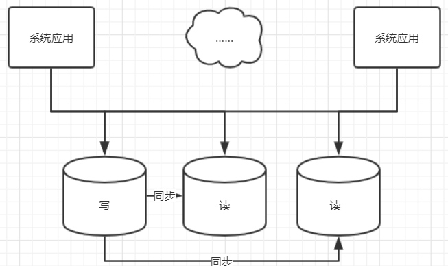

# 读写分离

把数据库中的读操作和写操作分开，让所有读的请求落到专门负责读的数据库上，所有写的操作落到专门负责写的数据库上，然后再把写库的数据同步到读库上，这样保证所有的数据修改都可以在读取时从读库获得。

系统的架构如图所示：

## 读写分离的弊端

同步操作需要消耗时间，同步时间过长，会导致数据延迟，严重的一旦同步宕机，会导致数据不一致。

数据同步的建议：网络延迟应该在5ms以内。

