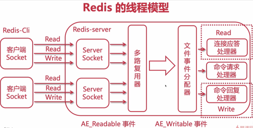

# Redis 概述

Redis：开源、基于键值的存储服务系统，支持多种数据结构，高性能、功能丰富。

Redis是C语言实现的。

Redis的特性：

- 速度快，官方宣称10W OPS（每秒实现10万次读写），Redis将数据存放在内存当中的（Redis速度快的最主要的原因）。Redis是单线程的线程模型。
- 持久化：断电不丢数据，Redis所有数据保持在内存中，对数据的更新将异步地保存到磁盘上。
- 多种数据结构：Strings/Blobs/Bitmaps（位图）、Hash Tables(objects)、Linked Lists、Sets、Sorted Sets、HyperLogLog（超小内存唯一值计数）、GEO（地理信息定位）
- 支持多种编程语言
- 功能丰富：发布订阅、Lua脚本（实现自定义命令）、事务、pipeline（并发效率）
- 简单：不依赖外部库、单线程模型。
- 主从复制：主服务器可以将数据复制到从服务器上。
- 高可用、分布式：Redis-Sentinel（v2.8）支持高可用。Redis-Cluster(V3.0)支持分布式。

Redis典型使用场景：

- 缓存系统：Storate（MySQL）------->Cache（Redis）------> App Server（Nginx）
- 计数器：例如评论数、转发数、浏览数等
- 消息队列系统：Redis提供了发布订阅消息订阅
- 排行榜
- 社交网络
- 实时系统：垃圾邮件、布隆过滤器（基于Redis位图实现）

Redis 单线程为什么这么快：

- 纯内存

- 非阻塞IO，多路复用

  

- 避免线程切换和竞态消耗

单线程模型下的注意点：

- 一次只能运行一条命令
- 不要使用长（慢）命令，如：keys，flushall，flushdb，slow lua script，mutil/exec，operate big value（Collection）等
- 这里的单线程只是用在读取值，而数据持久化不是使用的单线程。