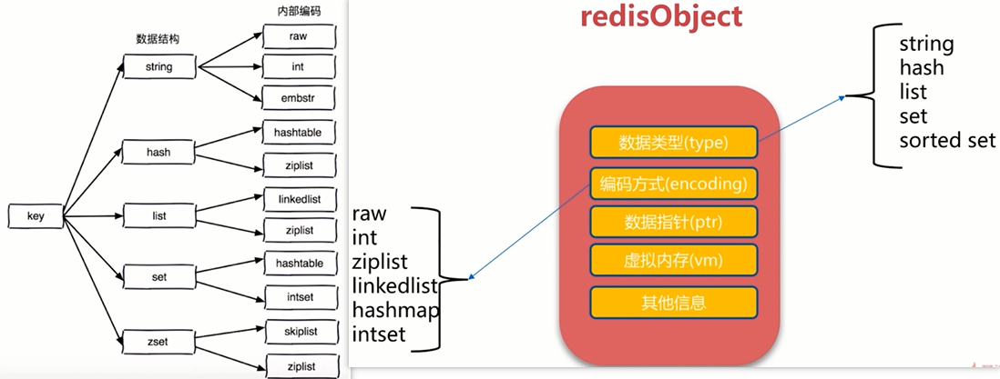

# Redis 数据类型及操作命令

Redis有5种主要的数据类型：

- string：字符串
- hash：字典
- list：列表，元素可重复。
- set：集合，元素不可重复。
- zset：有序集合

其他衍生出来的数据类型：

- BitMaps，本质依然是字符串
- Blobs
- HyperLogLog
- GEO




## Redis API 通用命令

### keys

用于获取key，可以使用通配符，时间复杂度O(n)。

获取所有key，不建议在生产上使用，会有性能影响。

```
keys *
```

获取以“a“开头的所有key：

```
keys a*
```

获取以“a”结尾的所有key：

```
keys *a
```

### dbsize

计算key的总数，不是每次汇总的，而是内部有一个计数器，其时间复杂度是O(1)。

```
dbsize
```

### exists

检查key是否存在，存在返回1，不存在返回0。其时间复杂度是O(1)。

```
exists k
```

### del

不管值是什么类型，都可以使用del语句来删除key，并且支持同时删除多个key。其时间复杂度是O(1)。

del命令用于删除key：

```shell
127.0.0.1:6379> del age
(integer) 1
```

### type

查看类型：

```shell
127.0.0.1:6379> type age
string
```

### select

切换当前数据库，类似于sqlserver中的use语句。

例如：切换到索引下标为1的数据库中：

```shell
127.0.0.1:6379> select 1
OK
127.0.0.1:6379[1]> 
```

### ttl

ttl 是 time to leave 的缩写，用于查看key离过期剩余的时间，单位是秒。

```shell
127.0.0.1:6379> ttl age
(integer) -1
```

-1 表示过期时间无穷大，永不过期。

 ### expire 

expire为key设置过期时间，单位是秒。key在seconds秒后过期。

```shell
127.0.0.1:6379> EXPIRE age 30
(integer) 1
127.0.0.1:6379> ttl age
(integer) 28
```

一旦过期之后，ttl值会变成-2，此时获取key的值时，就不存在了。

```shell
127.0.0.1:6379> ttl age
(integer) -2
127.0.0.1:6379> get age
(nil)
```

除了expire之外，也可以在set时使用如下命令设置过期时间：

```shell
127.0.0.1:6379> set name wy ex 20
OK
127.0.0.1:6379> get name
"wy"
127.0.0.1:6379> ttl name
(integer) 12
127.0.0.1:6379> 

```

效果和expire一样。

### persist

去掉key的过期时间，使key永不过期。

```
persist k
```

### flushdb 和 flushall

flushdb用于清空当前库的内容。

flushall用于清空全部所有库的内容。

这两个操作需谨慎，内容一旦清空后不能够恢复。

```shell
127.0.0.1:6379> flushdb
OK
127.0.0.1:6379> flushall
OK
127.0.0.1:6379> 
```


## string（字符串类型）

值虽然是字符串，但是值本身表示的可以是数字、二进制等其他类型数据，只是以字符串的形式存在Redis中而已。

字符串的Value不能大于512MB，建议在100K以内。一旦太大，有以下缺点：

- 消耗网络流量
- 读取慢

### set、mset 

set命令用于设置值，如果已经存在key，会覆盖掉旧的值，如果不存在Key，会添加新值：

```shell
set age 18
```

可以在set命令中添加xx使只在key存在的情况下才更新数据，类似于Update，如果key不存在将不会更新成功。

```shell
127.0.0.1:6379> set name wy xx
```

在设置值的时候指定过期时间，单位是秒：

```shell
127.0.0.1:6379> set name wy ex 20
OK
127.0.0.1:6379> get name
"wy"
127.0.0.1:6379> ttl name
(integer) 12
```

mset 命令用于同时设置一个或多个 key-value 对。

```shell
redis 127.0.0.1:6379> MSET key1 "Hello" key2 "World"
```


### SETNX

注意：如果已经存在某个key的值，此时使用SETNX，不会被更新：

```shell
127.0.0.1:6379> get age
"30"
127.0.0.1:6379> SETNX age 33
(integer) 0
127.0.0.1:6379> get age
"30"
```

setnx只能用于设置不存在的key。

### get

get命令用于获取值：

```shell
127.0.0.1:6379> get age
"18"
```

### append

拼接字符串，返回拼接后的字符串的长度。

```shell
127.0.0.1:6379> set name abc
OK
127.0.0.1:6379> get name
"abc"
127.0.0.1:6379> append name def
(integer) 6  
127.0.0.1:6379> get name
"abcdef"
```

### STRLEN 

查看字符串长度，注意是字节数，一个汉字两个字节。Redis内部已做优化，类似于计数器，时间复杂度也是O(1)。

```shell
127.0.0.1:6379> STRLEN name
(integer) 6
```

### mget 、mset 、msetnx

同时获取或设置多个key的值，时间复杂度O(n)。

1次mget = 1次网络时间 + n 次命令时间。

```shell
127.0.0.1:6379> mset k1 aa k2 bb k3 cc
OK
127.0.0.1:6379> mget k1 k2 k3
1) "aa"
2) "bb"
3) "cc"
127.0.0.1:6379> 
```

msetnx 也不能设置已经存在的key的值，设置了不会影响旧值：

```shell
127.0.0.1:6379> msetnx k1 123 k2 123
(integer) 0
127.0.0.1:6379> mget k1 k2 k3
1) "aa"
2) "bb"
3) "cc"
```

### incr 和 decr

为指定key的值，进行累加和累减操作，每次执行都是加1或者减一。

注意：key的值必须是可以转换为整型的数据。

```powershell
127.0.0.1:6379> set age 18
OK
127.0.0.1:6379> incr age
(integer) 19
127.0.0.1:6379> get age
"19"
127.0.0.1:6379> decr age
(integer) 18
127.0.0.1:6379> decr age
(integer) 17
```

### incrby 、incrbyfloat 和 decrby

为指定key的值，进行指定数量的累加和累减操作。

incrby进行整数累加，incrbyfloat进行小数累加。

例如，每次累加5和累减10：

```shell
127.0.0.1:6379> INCRBY age 5
(integer) 22
127.0.0.1:6379> INCRBY age 5
(integer) 27
127.0.0.1:6379> DECRBY age 10
(integer) 17
127.0.0.1:6379> DECRBY age 10
(integer) 7
```

### getrange 和 setrange

getrange 将指定key的值按照索引进行截取。-1表示到最后。

```shell
127.0.0.1:6379> get name
"abcdef"
127.0.0.1:6379> getrange name 0 -1
"abcdef"
127.0.0.1:6379> getrange name 2 4
"cde"
```

setrange 按照指定索引下标替换值。

```shell
127.0.0.1:6379> SETRANGE name 1 wwwww
(integer) 6
127.0.0.1:6379> get name
"awwwww"
```

### getset

设置新值，并返回设置前的旧值。

语法：

```
getset key newvalue
```


## hash（Hash 键值结构）

hash存储的数据结构和json对象类似，例如：

```json
{
	"user" : {
		"name" : "wy",
        "age" : "20"
	}
}
```

其中user作为key指定，其他作为一个单独对象的形式存储。有点类似键值对中的键值对，且Field不能相同，但Value可以相同。

hash不能设置二级属性的过期时间。

### hset 和 hget

使用hset创建key为user，值为一个对象，对象包含了name属性，name属性的值为“wy"：

```shell
127.0.0.1:6379> hset user name wy
(integer) 1
```

使用hget获取user下的name的值：

```shell
127.0.0.1:6379> hget user name
"wy"
```

hset和hget只能设置或获取单个属性的值，时间复杂度都是O(1)。

### hmset 和 hmget 、hgetall

同时设置或获取多个对象的值。时间复杂度O(n)。

```
127.0.0.1:6379> hmset user age 18 sex 男
OK
127.0.0.1:6379> hmget user name age sex
1) "wy"
2) "18"
3) "\xe7\x94\xb7"
127.0.0.1:6379> 
```

如果已经存在user，使用hmset时，会在原来的上面追加新的属性。

也可以直接使用hgetall获取对象的全部属性：

```shell
127.0.0.1:6379> hgetall user
1) "name"
2) "wy"
3) "age"
4) "18"
5) "sex"
6) "\xe7\x94\xb7"
127.0.0.1:6379> 
```

### hexists

判断对象的某个属性是否存在。存在返回1，不存在返回0。

```
127.0.0.1:6379> hexists user age
(integer) 1
```

### hlen

获取对象包含多少属性。

```shell
127.0.0.1:6379> hlen user
(integer) 3
```

### hkeys 和 hvals

获取当前对象包含的所有的key或value。

```
127.0.0.1:6379> hkeys user
1) "name"
2) "age"
3) "sex"
127.0.0.1:6379> hvals user
1) "wy"
2) "18"
3) "\xe7\x94\xb7"
```

### hincrby、hincrbyfloat

累加指定值。

hincrby进行整数累加，hincrbyfloat进行小数累加。

```shell
127.0.0.1:6379> HINCRBY user age 3
(integer) 21
127.0.0.1:6379> HINCRBY user age 3
(integer) 24
127.0.0.1:6379> HINCRBYFLOAT user age 1.4
"25.4"
127.0.0.1:6379> HINCRBYFLOAT user age 1.4
"26.8"
127.0.0.1:6379> 
```

### hdel

hdel不能直接删除key的整个对象，必须要指定删除的key对应的属性来一个一个的删除。

```shell
127.0.0.1:6379> HDEL user
(error) ERR wrong number of arguments for 'hdel' command
127.0.0.1:6379> HDEL user age
(integer) 1
```


## list（列表）

表示**有序**列表，允许存放**重复**的元素。

### lpush 和 rpush

都用于创建list并添加元素到列表中。不同的是添加元素的顺序不同。

```
127.0.0.1:6379> lpush list1 zs lb gy
(integer) 3
127.0.0.1:6379> lrange list1 0 -1
1) "gy"
2) "lb"
3) "zs"
127.0.0.1:6379> rpush list2 zs lb gy
(integer) 3
127.0.0.1:6379> lrange list2 0 -1
1) "zs"
2) "lb"
3) "gy"
```

也就是说，如果要list中存储的元素顺序和添加顺序相同，需要使用rpush指令。

### lpop 和 rpop

从list中取出并移除一个元素。不同的是取值的方向不同，一个是从左侧取出并移除元素，一个是从右侧取出并移除元素。时间复杂度是O(1)。

```shell
127.0.0.1:6379> lrange list1 0 -1
1) "cc"
2) "bb"
3) "aa"
127.0.0.1:6379> lpop list1
"cc"
127.0.0.1:6379> lrange list1 0 -1
1) "bb"
2) "aa"
```

```shell
127.0.0.1:6379> lrange list2 0 -1
1) "aa"
2) "bb"
3) "cc"
127.0.0.1:6379> rpop list2
"cc"
127.0.0.1:6379> lrange list2 0 -1
1) "aa"
2) "bb"
```

### lrange

```
lrange key start end（包含end）
```

获取列表中指定索引端之间的元素。-1 表示全部。

```
127.0.0.1:6379> lrange list1 0 -1
1) "gy"
2) "lb"
3) "zs"
```

### llen

获取列表元素长度。

```
127.0.0.1:6379> llen list2
(integer) 2
```

### lindex

获取指定索引下标的元素，索引从0开始。

```shell
127.0.0.1:6379> LRANGE list3 0 -1
1) "a"
2) "b"
3) "c"
4) "d"
5) "e"
6) "f"
127.0.0.1:6379> lindex list3 3
"d"
```

### lset

```
lset key index newValue
```

设置指定索引下标的元素的值。

```shell
127.0.0.1:6379> lset list3 3 dddddddd
OK
127.0.0.1:6379> LRANGE list3 0 -1
1) "a"
2) "b"
3) "c"
4) "dddddddd"
5) "e"
6) "f"
```

### linsert

```
linsert key before|after value newValue
```

在list指定的值前|后插入newValue。将某个新元素插入到指定元素之前或之后。时间复杂度O(n)。

将“bbbb”插入到元素“c”之前：

```shell
127.0.0.1:6379> linsert list3 before c bbbb
(integer) 7
127.0.0.1:6379> LRANGE list3 0 -1
1) "a"
2) "b"
3) "bbbb"
4) "c"
5) "dddddddd"
6) "e"
7) "f"
127.0.0.1:6379> 
```

将“cccc”插入到元素“bbbb”之后：

```
127.0.0.1:6379> linsert list3 after  bbbb cccc
(integer) 8
127.0.0.1:6379> LRANGE list3 0 -1
1) "a"
2) "b"
3) "bbbb"
4) "cccc"
5) "c"
6) "dddddddd"
7) "e"
8) "f"
127.0.0.1:6379> 

```

### lrem

从列表中删除指定数量的元素，适用于列表中重复元素需要移除的操作，时间复杂度O(n)。

```
lrem key count value
```

根据Count值，从列表中删除所有Value相等的项。

- count>0，从左到右，删除最多count个Value相等的项、
- count<0，从右到左，删除最多Math.Abs(count)个value相等的项
- count=0，删除所有value相等的项

例如，将列表中是“bbbb”的元素删除其中的一个：

```shell
127.0.0.1:6379> lrem list3 1 bbbb
(integer) 1
```

### ltrim

```
ltrim key start end
```

安装索引范围修剪列表，时间复杂度O(n)。

截取列表中指定索引段的元素，并将截取的列表替换掉原来的列表。

ltrim操作会修改原来的列表，变成新截取的列表。

```shell
127.0.0.1:6379> LRANGE list3 0 -1
1) "a"
2) "b"
3) "cccc"
4) "c"
5) "dddddddd"
6) "e"
7) "f"
127.0.0.1:6379> ltrim list3 2 4
OK
127.0.0.1:6379> LRANGE list3 0 -1
1) "cccc"
2) "c"
3) "dddddddd"
```

### blpop 和 brpop

```
blpop key timeout
```

lpop和rpop的阻塞版本，timeout是阻塞超时时间，timeout=0为永远不阻塞。


### 列表操作组合能够实现的功能

- LPUSH + LPOP = Stack

- LPUSH + RPOP = Queue

- LPUSH + LTRIM = Capped Collection（固定数量的列表）
- LPUSH + BRPOP = Message Queue


## set（集合）

无序不重复。不允许放入重复的元素。并且元素是无序的。支持集合间操作。

### sadd

```
sadd key element
```

向集合key添加Element，如果element已经存在，添加失败。

创建set，并添加元素，如果元素有重复项，会自动去重。

```
127.0.0.1:6379> sadd set2 a b c d e f a b c
(integer) 6
```

### srem

从set中删除指定元素。

```shell
127.0.0.1:6379> srem set2 d
(integer) 1
127.0.0.1:6379> SMEMBERS set2
1) "c"
2) "a"
3) "f"
4) "e"
5) "b"

```

### spop

从set中随机获取并移除指定数量的元素，如果不指定数量，默认是1。

```shell
127.0.0.1:6379> SMEMBERS set2
1) "c"
2) "a"
3) "f"
4) "e"
5) "b"
127.0.0.1:6379> spop set2 2
1) "b"
2) "a"
127.0.0.1:6379> spop set2
"f"
127.0.0.1:6379> SMEMBERS set2
1) "c"
2) "e"
127.0.0.1:6379> 
```

### smembers

查看set的内容。

```
127.0.0.1:6379> smembers set2
1) "c"
2) "a"
3) "d"
4) "f"
5) "e"
6) "b"
```

### srandmember

从set中随机取出指定数量的元素，不会破坏集合。

```shell
127.0.0.1:6379> srandmember set1 3
1) "d"
2) "a"
3) "b"
127.0.0.1:6379> srandmember set1 3
1) "c"
2) "d"
3) "b"
```

### scard

查看set元素的数量。

```
127.0.0.1:6379> scard set2
(integer) 6
```

### sismember

判断指定元素是否在set中。存在返回1，不存在返回0。

```
127.0.0.1:6379> sismember set2 d
(integer) 1

```

### smove

将一个set中的指定元素移动到另一个set中。

例如，将set1中的“f”移动到set2中：

```powershell
127.0.0.1:6379> SMEMBERS set1
1) "d"
2) "b"
3) "a"
4) "c"
5) "f"
6) "e"
127.0.0.1:6379> SMEMBERS set2
1) "c"
2) "e"
127.0.0.1:6379> smove set1 set2 f
(integer) 1
127.0.0.1:6379> SMEMBERS set1
1) "c"
2) "a"
3) "d"
4) "e"
5) "b"
127.0.0.1:6379> SMEMBERS set2
1) "c"
2) "f"
3) "e"
```

### sdiff

获取一个set在另一个set中不同的元素。（差集）

例如，获取set1中的不存在于set2中的元素，即：set1中有，set2中没有的元素：

```
127.0.0.1:6379> SMEMBERS set1
1) "c"
2) "a"
3) "d"
4) "e"
5) "b"
127.0.0.1:6379> SMEMBERS set2
1) "c"
2) "f"
3) "e"
127.0.0.1:6379> sdiff set1 set2
1) "b"
2) "d"
3) "a"

```

### sinter

获取同时存在于两个set中的元素。（交集）

例如，获取set1中有，并且set2中也有的元素：

```shell
127.0.0.1:6379> SMEMBERS set1
1) "c"
2) "a"
3) "d"
4) "e"
5) "b"
127.0.0.1:6379> SMEMBERS set2
1) "c"
2) "f"
3) "e"
127.0.0.1:6379> sinter set1 set2
1) "c"
2) "e"
```

### sunion

获取两个set的并集。

```shell
127.0.0.1:6379> sunion set1 set2
1) "c"
2) "a"
3) "d"
4) "f"
5) "e"
6) "b"
```


## zset（Sorted Sets，有序集合）

sorted set，有序不重复。不允许放入重复的元素，元素的顺序是有序的。

与set相比，除了有序之外，在使用时，不仅要指定元素名还需要指定每个元素的score值，zset将会根据score值进行排序。

### zadd

```
zadd key score element（可以是多对）
```

添加score和element。

向set中添加元素，指定元素名和score值：

```shell
127.0.0.1:6379> zadd zset1 10 AA 20 BB 30 CC 40 DD 50 EE
(integer) 5
127.0.0.1:6379> zrange zset1 0 -1 withscores
 1) "AA"
 2) "10"
 3) "BB"
 4) "20"
 5) "CC"
 6) "30"
 7) "DD"
 8) "40"
 9) "EE"
10) "50"
```

如果存在元素名，新的score值，会覆盖旧的：

```shell
127.0.0.1:6379> zadd zset1 15 AA
(integer) 0
127.0.0.1:6379> zadd zset1 15 abc 23 xyz
(integer) 2
127.0.0.1:6379> zrange zset1 0 -1 withscores
 1) "AA"
 2) "15"
 3) "abc"
 4) "15"
 5) "BB"
 6) "20"
 7) "xyz"
 8) "23"
 9) "CC"
10) "30"
11) "DD"
12) "40"
13) "EE"
14) "50"
```

### zrange

```
zrange key start end [withscores]
```

返回指定索引范围内的升序元素[分值]。

只显示元素名：

```
127.0.0.1:6379> zrange zset1 0 -1
1) "AA"
2) "BB"
3) "CC"
4) "DD"
5) "EE"
```

显示元素名和score：

```shell
127.0.0.1:6379> zrange zset1 0 -1 withscores
 1) "AA"
 2) "10"
 3) "BB"
 4) "20"
 5) "CC"
 6) "30"
 7) "DD"
 8) "40"
 9) "EE"
10) "50"
```

### zrank

获取zset中，指定元素的索引下标，从0开始。

```shell
127.0.0.1:6379> zrange zset1 0 -1
1) "AA"
2) "abc"
3) "BB"
4) "xyz"
5) "CC"
6) "DD"
7) "EE"
127.0.0.1:6379> zrank zset1 xyz
(integer) 3
```

### zscore

获取指定元素的score值。

```
127.0.0.1:6379> zscore zset1 xyz
"23"
```

### zcard

获取zset元素个数。

```shell
127.0.0.1:6379> zcard zset1
(integer) 7
```

### zcount 和 zrangebyscore

zcount ：获取score在指定范围内的元素个数。

zrangebyscore：获取score在指定范围内的元素集。

例如，获取 score>=20 && score <=40 的元素个数：

```shell
127.0.0.1:6379> zcount zset1 20 40
(integer) 4
```

对应的，如果想要获取score>=20 && score <=40 的元素有哪些：

```shell
127.0.0.1:6379> zrangebyscore  zset1 20 40
1) "BB"
2) "xyz"
3) "CC"
4) "DD"
```

如果想要查看对应的score值，可以加上withscores关键字：

```shell
127.0.0.1:6379> zrangebyscore  zset1 20 40 withscores
1) "BB"
2) "20"
3) "xyz"
4) "23"
5) "CC"
6) "30"
7) "DD"
8) "40"
```

默认是大于等于或小于等于，如果只想大于或小于，可以借助小括号使用如下语法。

例如，获取 score>20 && score <40 的元素个数：

```shell
127.0.0.1:6379> zrangebyscore  zset1 (20 (40 withscores
1) "xyz"
2) "23"
3) "CC"
4) "30"
```

加了小括号表示不包括值本身的数据。

zrangebyscore 可以结合limit实现子集筛选。

例如在zrangebyscore结果集中，使用limit从索引为1的下标开始，截取2个元素。

```shell
127.0.0.1:6379> zrangebyscore  zset1 20 40
1) "BB"
2) "xyz"
3) "CC"
4) "DD"
127.0.0.1:6379> zrangebyscore  zset1 20 40 limit 1 2
1) "xyz"
2) "CC"
```

### zrem

从zset中删除指定名称的元素，可以同时指定多个member名称。

```shell
127.0.0.1:6379> zrem zset1 xyz abc
(integer) 2
```

### zremrangebyrank

```
zremrangebyrank key start end
```

删除指定排名内的升序元素。

### zremrangebyscore

```
zremrangebyscore key minScore maxScore
```

删除指定分数内的升序元素。

### zincrby

```
zincrby key increScore element
```

增加或减少元素的分数。

```
zincrby zset1 2 xyz
```

### zrevrank

### zrevrange

### zrevrangebyscore

### zinterstore

### zunionstore


## BitMaps（位图）

位图


## HyperLogLog

超小内存唯一值计数


## GEO

地理信息定位
