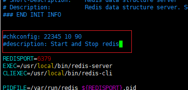
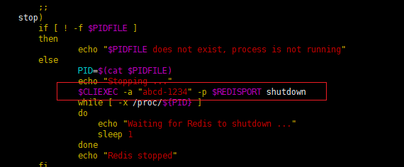

# Redis 安装与配置


## 下载并编译安装 Redis

第一步：下载离线安装包

推荐使用镜像下载Redis离线安装包，然后上传到Linux服务器中，将其放在目录/home/software下，并解压安装包：

```shell
[root@localhost ~]# cd /home/software/
[root@localhost software]# ls
redis-6.0.15.tar.gz
[root@localhost software]# tar -zxvf redis-6.0.15.tar.gz
```

第二步：编译并安装

编译前，需要安装如下组件：

```shell
[root@localhost redis-6.0.15]# yum install gcc-c++
```

redis 6+版本在安装的时候，需要升级其他组件版本：

```shell
yum -y install centos-release-scl && yum -y install devtoolset-9-gcc devtoolset-9-gcc-c++ devtoolset-9-binutils && scl enable devtoolset-9 bash
```

编译并安装：

```shell
make && make install
```


## 配置 redis

### redis.conf 文件的配置

创建redis程序目录，用于存放配置文件，并将redis.conf 复制到该目录中：

```shell
[root@localhost utils]# cd /home/software/redis-6.0.15
[root@localhost redis-6.0.15]# mkdir /usr/local/redis -p
[root@localhost redis-6.0.15]# cp redis.conf /usr/local/redis
[root@localhost redis-6.0.15]# cd /usr/local/redis
```

编辑 redis.conf 文件，进行如下设置：

- 设置redis后台运行

  ```shell
  daemonize yes
  ```

- 设置redis工作目录

  ```shell
  # The working directory.
  #
  # The DB will be written inside this directory, with the filename specified
  # above using the 'dbfilename' configuration directive.
  #
  # The Append Only File will also be created inside this directory.
  #
  # Note that you must specify a directory here, not a file name.
  dir /usr/local/redis/working
  ```

  设置完成之后，需要创建/usr/local/redis/working目录：

  ```shell
  [root@localhost redis]# pwd
  /usr/local/redis
  [root@localhost redis]# mkdir working
  [root@localhost redis]# ll
  总用量 84
  -rw-r--r--. 1 root root 85583 10月 28 15:39 redis.conf
  drwxr-xr-x. 2 root root     6 10月 28 15:40 working
  ```

- 设置允许其他机器进行访问：

  ```shell
  # Examples:
  #
  # bind 192.168.1.100 10.0.0.1
  # bind 127.0.0.1 ::1
  #
  ....
  # IF YOU ARE SURE YOU WANT YOUR INSTANCE TO LISTEN TO ALL THE INTERFACES
  # JUST COMMENT OUT THE FOLLOWING LINE.
  # ~~~~~~~~~~~~~~~~~~~~~~~~~~~~~~~~~~~~~~~~~~~~~~~~~~~~~~~~~~~~~~~~~~~~~~~~
  bind 0.0.0.0
  ```

- 设置连接使用的密码，默认是没有密码的，一定要进行设置，这里将密码设置为了abcd-1234：

  ```shell
  # IMPORTANT NOTE: starting with Redis 6 "requirepass" is just a compatibility
  # layer on top of the new ACL system. The option effect will be just setting
  # the password for the default user. Clients will still authenticate using
  # AUTH <password> as usually, or more explicitly with AUTH default <password>
  # if they follow the new protocol: both will work.
  #
   requirepass abcd-1234
  ```

- 设置端口号，默认为6379，一般不用更改：

  ```shell
  port 6379
  ```

- 设置 pid文件位置，一般不需要更改：

  ```shell
  pidfile /var/run/redis_6379.pid
  ```

  

配置完成之后，保存退出。


### redis_init_script文件的配置

redis_init_script文件设置的内容，和redis.conf是一一对应的。

进入utils目录，将redis_init_script文件，复制到 /etc/init.d/ 目录中：

```shell
[root@localhost redis-6.0.15]# cd utils/
[root@localhost utils]# pwd
/home/software/redis-6.0.15/utils
[root@localhost utils]# cp redis_init_script /etc/init.d/
[root@localhost redis]# cd /etc/init.d
vim redis_init_script
```

编辑 redis_init_script文件，进行如下设置：

- 修改redis的配置文件位置，将其指向上述redis.conf所在的位置：

  ```shell
  CONF="/usr/local/redis/redis.conf"
  ```

  退出并保存该文件。

  为redis_init_script设置可执行权限：

  ```shell
  [root@localhost init.d]# chmod 777 redis_init_script 
  ```

  运行该文件，启动redis（停止命令见下文）。

  ```shell
  [root@localhost init.d]# ./redis_init_script start
  [root@localhost init.d]# ps -ef | grep redis
  root       6430      1  0 15:59 ?        00:00:00 /usr/local/bin/redis-server 0.0.0.0:6379
  root       6436   5985  0 15:59 pts/1    00:00:00 grep --color=auto redis
  ```

- 配置Redis开机自启动，在redis_init_script文件中，加入如下内容：

  ```shell
  #chkconfig: 22345 10 90
  #description: Start and Stop redis
  ```

  注意：这两行内容是chkconfig命令的写法，本身就带有#号，是不能删除掉的，所在位置如下图所示：

  

  保存并退出，执行如下命令设置开机自启动：

  ```shell
  [root@localhost init.d]# chkconfig redis_init_script on
  ```
  
- 为stop指令指定密码，从而实现通过redis_init_script来停止Redis服务：

  ```shell
  $CLIEXEC -a "abcd-1234" -p $REDISPORT shutdown
  ```
  
  配置完成之后，如下所示：
  
  
  
  此时如果想要停止redis，可以使用如下命令：
  
  ```shell
  [root@localhost init.d]# ./redis_init_script stop
  Stopping ...
  Warning: Using a password with '-a' or '-u' option on the command line interface may not be safe.
  Redis stopped
  ```
  
  


## 运行并测试 redis-cli

  

  直接输入redis-cli启动客户端，由于设置了密码，因此还需要指定密码：

  ```shell
  [root@localhost ~]# redis-cli
  127.0.0.1:6379> auth abcd-1234
  OK
  127.0.0.1:6379>
  ```

  ### redis-cli 相关命令

  查看redis是否存活：

  ```shell
  [root@localhost ~]# redis-cli -a abcd-1234 ping
  Warning: Using a password with '-a' or '-u' option on the command line interface may not be safe.
  PONG
  ```

  除了使用`./redis_init_script stop`关闭redis之外，也可以通过如下命名关闭redis：

```shell
redis-cli -a abcd-1234 shutdown
```


  

