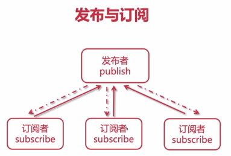
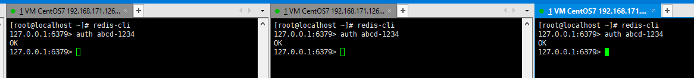
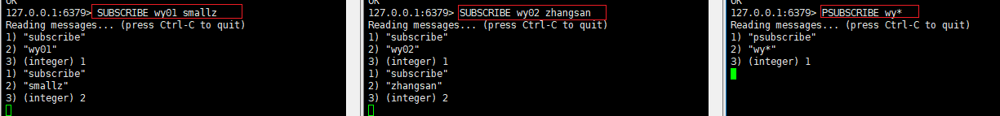
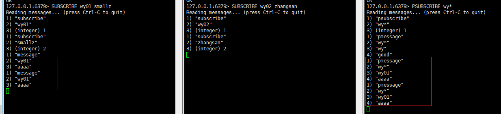

# Redis 发布与订阅

Redis的发布订阅功能可以实现消息队列类似的功能。

注：不推荐Redis作为消息队列来使用。


## 发布与订阅关系图




## Redis 发布订阅演示

### 订阅者

登录到redis-client端，模拟订阅者监听消息。

可以同时打开并登录多个redis-client端，同一个redis-server，不同终端连接，如下所示：



#### 监听通道

使用**subscribe**来监听指定名称的通道。

例如，监听名称为wy01或smallz的两个通道：

```
127.0.0.1:6379> SUBSCRIBE wy01 smallz
Reading messages... (press Ctrl-C to quit)
1) "subscribe"
2) "wy01"
3) (integer) 1
1) "subscribe"
2) "smallz"
3) (integer) 2
```

也可以使用**psubscribe**以通配符的形式来监听多个通道。

例如，监听名称以wy开头的所有通道：

```
127.0.0.1:6379> PSUBSCRIBE wy*
Reading messages... (press Ctrl-C to quit)
1) "psubscribe"
2) "wy*"
3) (integer) 1
```

在三个终端窗口中，分别进行监听通道：



此时，打开另一个终端，登录redis-client端，作为发布者来模拟消息的发送。

### 发布者

登录到redis-client端，模拟发布者发送消息。

发送消息，使用**publish**。

例如，向通道wy01发送“aaaa”：

```
127.0.0.1:6379> PUBLISH wy01 aaaa
(integer) 2
```

此时可以看到，监听了wy01通道的终端都可以获取到“aaaa"：



