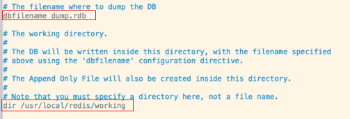

# Redis-持久化机制

两种机制：

- RDB（Redis Database），默认机制。
- AOF（Append Only File）


## RDB

RDB机制，指的是每隔一段时间，把内存中的数据写入磁盘的临时文件，作为快照。恢复的时候把快照文件读进内存。如果宕机重启，那么内存里的数据肯定会没有的，那么再次启动redis后，则会恢复。

- 备份：内存 => 备份到硬盘临时文件；
- 恢复：临时文件 => 恢复到内存；

RDB属于冷备。


### RDB优劣和劣势

优势：

- 每隔一段时间备份，全量备份；
- 灾备简单，可以远程传输；
- 子进程备份的时候，主进程不会有任何io操作（不会有写入修改或删除），保证备份数据的的完整性；
- 相对AOF来说，当有更大文件的时候可以快速重启恢复。

劣势：

- 发生故障时，有可能会丢失最后一次的备份数据；
- 子进程所占用的内存比会和父进程一模一样，如会造成CPU负担；
- 由于定时全量备份是重量级操作，所以对于实时备份，就无法处理了。

总结：RDB适合大量数据的恢复，但是数据的完整性和一致性可能会不足。


### RDB的配置

打开/usr/local/redis/redis.conf配置文件进行RDB的配置操作。

#### 配置rdb保存的位置

保存位置，可以在redis.conf自定义： /user/local/redis/working/dump.rdb



上述中的dir就是指定保存的目录。

#### 配置保存间隔时间和机制

时间以秒为单位，默认配置如下：

```powershell
# 如果有一个key发生了变化，那么将在900秒（15分钟）之后进行备份
save 900 1
# 如果有10个key发生了变化，将在5分钟之后备份
save 300 10
# 如果有1万个key发生了变化，将在1分钟之后备份
save 60 10000
```

#### stop-writes-on-bgsave-error

如果在备份的过程中发生了错误，就停止写操作。默认值为yes，一般不需要更改。

yes：如果save过程出错，则停止写操作。

no：可能造成数据不一致

#### rdbcompression

进行备份的时候，是否启用压缩模式，默认值为yes，一般不需要更改。

yes：开启rdb压缩模式

no：关闭，会节约cpu损耗，但是文件会大，道理同nginx。

#### rdbchecksum

使用压缩模式之后，是否使用CRC64算法校验对rdb进行数据校验。默认值为yes，一般不需要更改。

yes：使用CRC64算法校验对rdb进行数据校验，有10%性能损耗。

no：不校验。


## AOF

RDB会丢失最后一次备份的rdb文件，但是其实也无所谓，其实也可以忽略不计，毕竟是缓存，丢了就丢了，但是如果追求数据的完整性，那就的考虑使用AOF了。

AOF属于热备。

### AOF特点

- 以日志的形式来记录用户请求的写操作。读操作不会记录，只有写操作才会记录存储。
- 文件以追加的形式而不是修改的形式。
- redis的aof恢复其实就是把追加的文件从开始到结尾读取执行写操作。


### AOF 优势和劣势

优势：

- AOF更加耐用，可以以秒级别为单位备份，如果发生问题，也只会丢失最后一秒的数据，大大增加了可靠性和数据完整性。所以AOF可以每秒备份一次，使用fsync操作。
- 以log日志形式追加，如果磁盘满了，会执行 redis-check-aof 工具
- 当数据太大的时候，redis可以在后台自动重写aof。当redis继续把日志追加到老的文件中去时，重写也是非常安全的，不会影响客户端的读写操作。
- AOF 日志包含的所有写操作，会更加便于redis的解析恢复。

劣势：

- 相同的数据，同一份数据，AOF比RDB大
- 针对不同的同步机制，AOF会比RDB慢，因为AOF每秒都会备份做写操作，这样相对与RDB来说就略低。 每秒备份fsync没毛病，但是如果客户端的每次写入就做一次备份fsync的话，那么redis的性能就会下降。
- AOF发生过bug，就是数据恢复的时候数据不完整，这样显得AOF会比较脆弱，容易出现bug，因为AOF没有RDB那么简单，但是呢为了防止bug的产生，AOF就不会根据旧的指令去重构，而是根据当时缓存中存在的数据指令去做重构，这样就更加健壮和可靠了。


### AOF的配置

```shell
# AOF 默认关闭，yes可以开启
appendonly no

# AOF 的文件名
appendfilename "appendonly.aof"

# no：不同步
# everysec：每秒备份，默认值，推荐使用
# always：每次操作都会备份，安全并且数据完整，但是慢、性能差
appendfsync everysec

# 重写的时候是否要同步，no可以保证数据安全
no-appendfsync-on-rewrite no

# 重写机制：避免文件越来越大，自动优化压缩指令，会fork一个新的进程去完成重写动作，新进程里的内存数据会被重写，此时旧的aof文件不会被读取使用，类似rdb
# 当前AOF文件的大小是上次AOF大小的100% 并且文件体积达到64m，同时满足两者则触发重写
auto-aof-rewrite-percentage 100
# 64M较小，一般可以设置为4Gb
auto-aof-rewrite-min-size 64mb

```


## RDB 和 AOF 如何选择

- 如果你能接受一段时间的缓存丢失，那么可以使用RDB
- 如果你对实时性的数据比较care，那么就用AOF
- 使用RDB和AOF结合一起做持久化，RDB做冷备，可以在不同时期对不同版本做恢复，AOF做热备，保证数据仅仅只有1秒的损失。当AOF破损不可用了，那么再用RDB恢复，这样就做到了两者的相互结合，也就是说Redis恢复会先加载AOF，如果AOF有问题会再加载RDB，这样就达到冷热备份的目的了。