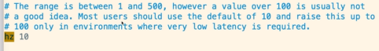
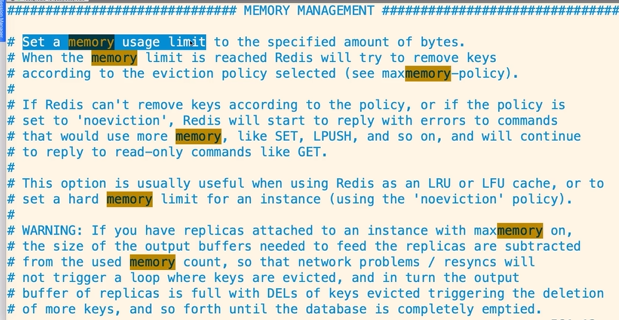
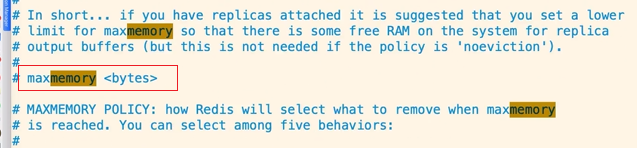
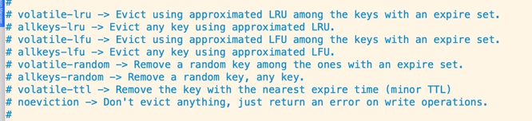
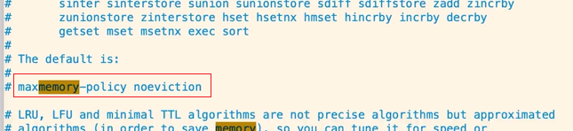

# Redis 缓存过期处理与内存淘汰机制

## 缓存过期删除策略

当Redis的key设置了expire后，一旦到达过期时间，有如下两种删除策略：

- （主动）定期删除：Redis定时定期进行检查，随机抽取指定数量的key，一旦发现key过期了，就删除掉。由于是定时检查key，因此会消耗CPU资源，但能够及时释放过期的key所占用的内存。

  在检索key时，默认一秒抽取10个key，可以通过redis.conf文件进行配置：

  

  取值范围在1~500之间，不建议超过100，一般采用默认配置即可。

- （被动）惰性删除：客户端只有在获取key时，才检测是否过期，一旦过期就删除。对CPU比较友好，但过期的key如果不被访问，会一直占用内存。

这两种策略是并存的，比如有1000个key在同一时刻过期，当主动删除时，并不能一次性删除全部的过期的key，假如1秒钟取10个key，需要100秒才能完全删除，此时当用户访问到过期的而没有删除的key时，就会触发被动删除。这也是为什么key设置了expire的过期时间，但服务器的内存仍被占用的原因。

## 内存淘汰管理机制

假如key没有设置过期时间或过期了未被清理，或者当前机器可用内存不足，此时可以通过Redis内存管理机制（Memory Management）来释放内存。

当到达redis设置的最大内存阈值（maxmemory）时，会主动清理内存。

这些都可以在redis.conf中配置实现。

配置Redis能够使用的最大内存：

自动清理算法：

- noeviction：旧缓存永不过期，新缓存设置不了，返回错误
- allkeys-lru：清除最少用的旧缓存，然后保存新的缓存（推荐使用）
- allkeys-random：在所有的缓存中随机删除（不推荐）
- volatile-lru：在那些设置了expire过期时间的缓存中，清除最少用的旧缓存，然后保存新的缓存；
- volatile-random：在那些设置了expire过期时间的缓存中，随机删除缓存
- volatile-ttl：在那些设置了expire过期时间的缓存中，删除即将过期的

