# Redis-主从架构与搭建

Redis主从架构也称为读写分离架构。可以进行节点的水平扩展。

- master，主节点，用于数据的写操作；
- slave，从节点，只用于数据库的读操作；


## Redis 主从原理

前提，Master节点必须要开启持久化RDB机制，如果不开启，一旦Master重启，再执行数据同步时，Master没有数据也会冲洗掉从节点的数据，导致数据丢失。

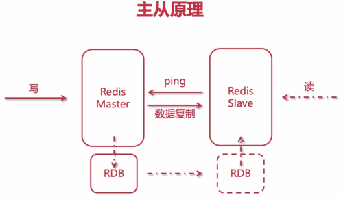

- 从节点发送ping包到主节点，告诉主节点该从节点已经启动了，主节点可以复制数据到从节点了。
- 主节点会复制一份新的RDB，通过网络（Socket）发送到从节点；
- 从节点收到RDB之后，先进行本地保存，然后再加载到从节点的内存中，从而完成数据的第一次复制过程；
- 后面再有主节点的写操作时，主节点会将每一次的操作命令都同步发送给从节点，从节点执行相应的命令，实现数据的同步。需要注意的是：无论从节点还是主节点，在数据同步的时候，都不会阻塞节点，它们会使用老的数据向外提供服务，一旦完成同步，会用新的数据替换掉老的数据来提供新的服务。
- 当从节点宕机之后，等到下次恢复，主节点依然会将数据同步给从节点。

总结：第一次是全量复制，后面的单次的操作同步。


## Redis 主从模式

由于主节点需要进行主从复制，会有一定的网络资源占用，所以主节点一般不会挂太多的从节点，常见的是一主二从。

简单的主从模式（用的最多的）：

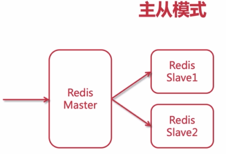

这种模式是用的最多的，最常见的模式。

复杂的树状主从模式：

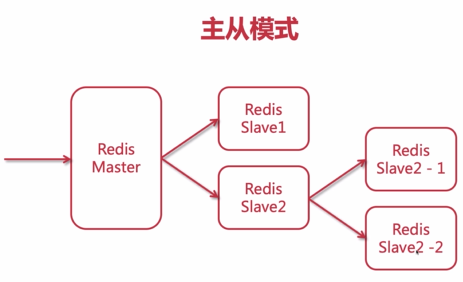

## Redis 主从搭建

本文的Redis节点说明：

- 192.168.171.126（Master）
- 192.168.171.200 （Slave）
- 192.168.171.201 （Slave）

登录到主节点的Redis客户端，查看当前Replication（主从模式下的方式）信息：

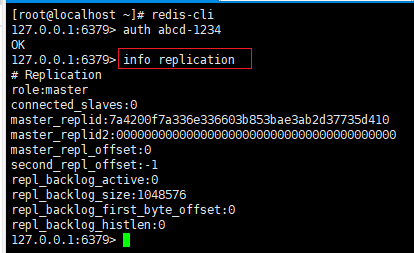

描述如下：

- role：当前节点角色，这里是master。
- connected_slaves：目前已连接到的从节点数量。


### 配置从节点

打开从节点（192.168.171.200）的终端，编辑从节点上面的redis.conf文件：

```shell
[root@localhost ~]# cd /usr/local/redis/
[root@localhost redis]# vim redis.conf 
```

搜索“Replication”：

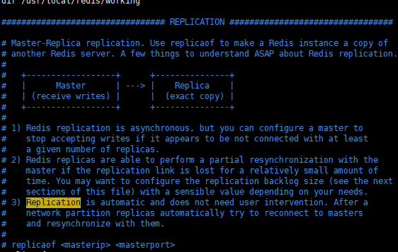

配置主节点IP和端口号：

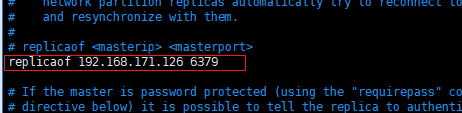

配置master节点的密码：

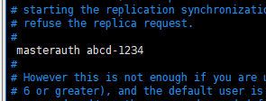

开启从节点只读模式，默认已开启，不需要更改：

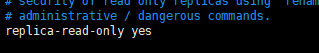

开启只读模式后，往从节点的Redis写入数据时，将会提示错误：

```shell
127.0.0.1:6379> set nihao nh
(error) READONLY You can't write against a read only replica.
```


配置完成之后，需要重启Redis：

```shell
[root@localhost redis]# /etc/init.d/redis_init_script  stop
Stopping ...
Warning: Using a password with '-a' or '-u' option on the command line interface may not be safe.
Redis stopped
[root@localhost redis]# /etc/init.d/redis_init_script  start
```

重新登录Redis-cli，查看从节点的Replication信息：

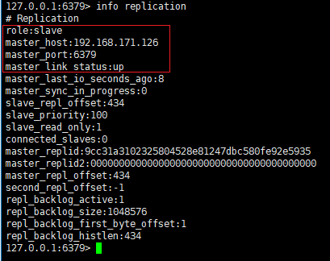

说明：如果master_link_status是down，所以master没有连接成功，可以检查配置是否正确，或主节点master是否开启了端口。

按照同样的方式，配置另一台slave节点（192.168.171.201），配置完成之后，打开master节点上的redis-cli，参看replication信息如下：

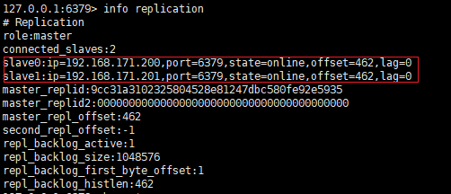

可以清楚的看到当前master上连接的从节点信息。

搭建好主从复制后，就能够实现读写分离，当某个从节点宕机之后，等到下次恢复运行，仍然能够同步得到主节点上面的最新数据。


## 无磁盘化复制

同步数据时，不是通过RDB文件，而是直接通过socket网络将内存中的数据写入到另一个内存中。

适用于磁盘性能差，而网络带宽高的场景。

无磁盘化复制机制，默认是关闭的，需要通过redis.conf配置文件，手动开启。

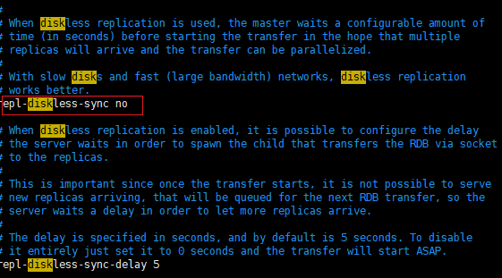

将repl-diskless-sync设置为true，表示开启diskless模式（无磁盘化复制）。

repl-diskless-sync-delay用于设置在同步从节点之前，等待多长时间用于从节点的网络连接，以便所有从节点都连接好了，再进行同步。