# Redis 哨兵模式

哨兵模式目的：当Master挂了之后，依旧保证Redis的可用性的，实现继续读写。


## Sentinel（哨兵）

Sentinel(哨兵)是用于监控Redis集群中Master状态的工具，是 Redis 高可用解决方案，哨兵可以监视一个或者多个redis master服务，以及这些master服务的所有从服务；当某个master服务宕机后，会把这个master下的某个从服务升级为master来替代已宕机的master继续工作。

Sentinel可以组成集群，用于监控一组Redis节点。

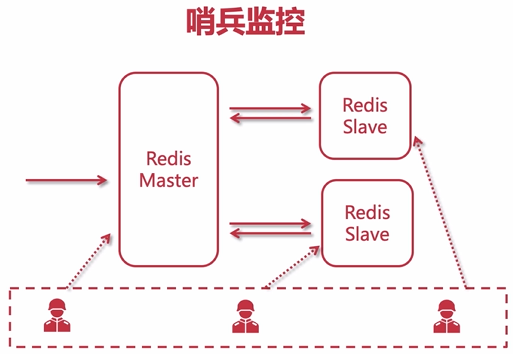


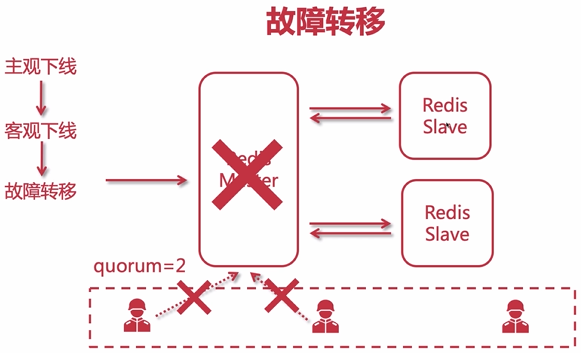


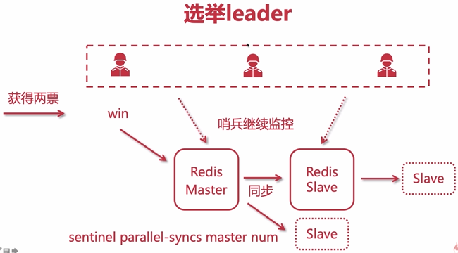

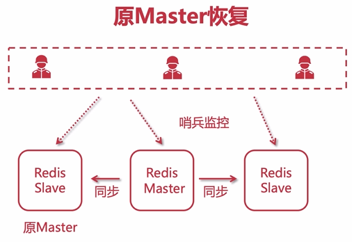

哨兵部署的约定：

- 哨兵节点要有至少3个或者奇数个节点；
- 哨兵要分布式部署在不同的计算机节点；
- 一组哨兵只监听一组主从。


## Sentinel的配置

配置哨兵的核心文件是sentinel.conf文件。

进入到Redis的安装目录，将 sentinel.conf 复制到redis.conf同级目录中。

```shell
[root@localhost ~]# cd /home/software/redis-6.0.15
[root@localhost redis-6.0.15]# cp sentinel.conf /usr/local/redis/
[root@localhost redis-6.0.15]# cd /usr/local/redis/
[root@localhost redis]# ll
总用量 96
-rw-r--r--. 1 root root 85581 10月 28 15:46 redis.conf
-rw-r--r--. 1 root root 10744 11月  1 18:39 sentinel.conf
drwxr-xr-x. 2 root root    22 11月  1 14:57 working
```

在sentinel.conf文件中，进行下述配置。

- 关闭保护模式，取消注释即可：

  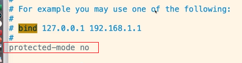

- 指定端口，保持默认即可：

  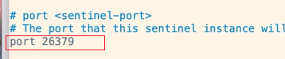

- 设置后台运行哨兵模式：

  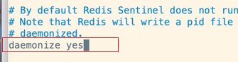

- 设置pid文件位置，保持默认即可：

  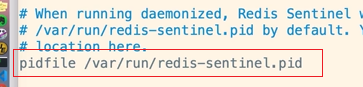

- 设置哨兵模式下，日志保持的位置，目录如果不存在需要提前创建：

  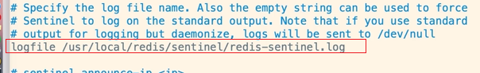

- 设置工作目录，建议和日志目录一致，目录如果不存在需要提前创建：

  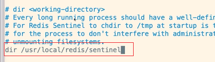

- 配置要监听的master节点信息：

  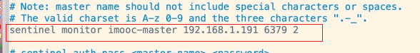

  - sentinel monitor是命令操作符；
  - 给master指定一个昵称，这里叫“immoc-master”；
  - 配置master节点的IP地址和端口号，这里master节点的ip是192.168.1.191，端口是6379；
  - quorum=2表示： 至少有2台哨兵发现master无法ping通，才对master进行宕机标记，这时候就可以执行故障转移，把从节点变成master。quorum一般设置为总的节点数除以2加一。大多数集群都应该部署为奇数个节点，以便类似哨兵这种机制，能够实现少数服从多数。

- 配置master节点的redis密码：

  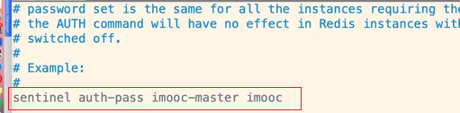

  - imooc-master是上述中指定的昵称；
  - imooc是master的redis密码。

- 为master主节点配置毫秒数时间，这个时间就是哨兵认为主节点失效的间隔时间，默认是30秒。一般保持默认，不需要修改。这里为了测试改为了10秒。

  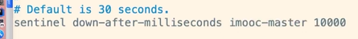

- 当一个从节点，被选举成为主节点之后，其他的从节点能够与新的主节点并行同步数据的从节点数量。默认是1，一般不需要修改。

  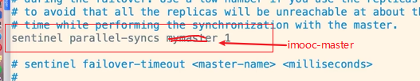

- 主备切换的超时时间，哨兵要去做故障转移，这个时候哨兵也是一个进程，如果他没有去执行，超过这个时间后，会由其他的哨兵来处理。默认是3分钟。

  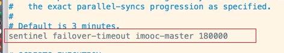

配置完成之后，保存并退出。

### 配置其他哨兵

只需要将已配置好的sentinel.conf文件复制到其他服务器中即可。

```shell
scp sentinel.conf root@192.168.171.200:/usr/local/redis/
...
scp sentinel.conf root@192.168.171.201:/usr/local/redis/
```

### 启动

分别在配置了sentinel.conf文件的节点上，执行下述命令来启动哨兵。

```shell
[root@localhost redis]# redis-sentinel sentinel.conf 
```

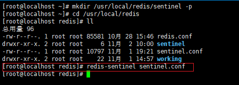

启动完成之后，可以检查一下redis的进程：

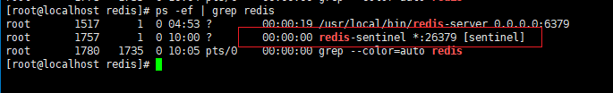

分别在其他服务器启动哨兵，就组成了哨兵集群。


## master被选举的机制

master挂了以后，由于哨兵监控，剩余slave会进行选举，选举后其中一个成为master，当原来的master恢复后，他会成为slave。

可能出现的问题：

master节点变成slave节点之后，不能同步新主节点的数据。对应的master_link_status一直是down状态。此时可以查看一下redis.conf文件中，是否指定了masterauth值，设置为新master节点的redis密码即可。


## 哨兵节点操作

连接哨兵端口：

```
[root@localhost redis]# redis-cli -p 26379
```

查看master节点信息，需要指定master昵称：

```
127.0.0.1:26379> sentinel master wy-master
```

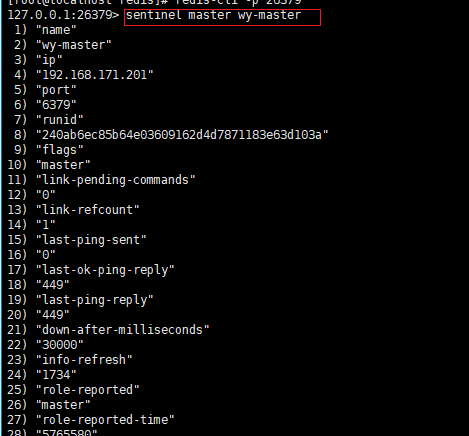

查看master下的slaves信息：

```
127.0.0.1:26379> sentinel slaves wy-master
```

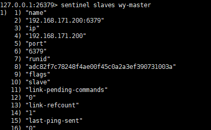

查看master下的除了当前节点之外的其他哨兵（slave）信息：

```
127.0.0.1:26379> sentinel sentinels wy-master
```

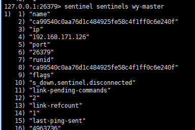


 


