# Redis 多主多从集群

主从复制以及哨兵都是基于“一主多从”来配置的，虽然能够提高读的并发，但是单个master容量是有限的，数据达到一定程度也会有瓶颈，这个时候可以通过水平扩展为多主多从组成集群。

 哨兵模式其实也是一种集群，它能够提高读请求的并发，但是容错方面可能会有一些问题，比如master同步数据给slave的时候，这其实是异步复制吧，这个时候master挂了，那么slave上的数据就没有master新，数据同步需要时间的，1-2秒的数据会丢失。master恢复并转换成slave后，新数据则丢失。

- 2台机器，只能选择一主一从；
- 3台机器，可以选择一主二从，并且能够引入哨兵，解决master单节点宕机问题。
- 6台及以上，可以搭建集群，此时就是多主多从，不需要配置哨兵。

## Redis 集群（redis-cluster）

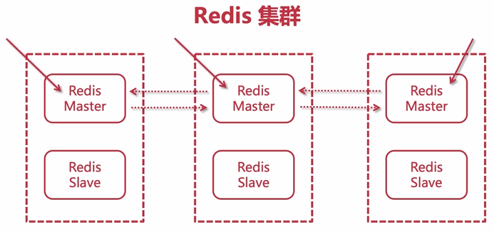

- 每个节点知道彼此之间的关系，也会知道自己的角色，当然他们也会知道自己存在与一个集群环境中，他们彼此之间可以交互和通信，比如ping pong。那么这些关系都会保存到某个配置文件中，每个节点都有，这个我们在搭建的时候会做配置的。
- 客户端要和集群建立连接的话，只需要和其中一个建立关系就行。
- 某个节点挂了，也是通过超过半数的节点来进行的检测，客观下线后主从切换，和我们之前在哨兵模式中提到的是一个道理。
- Redis中存在很多的插槽，又可以称之为槽节点，用于存储数据。

构建Redis集群，需要至少3个节点作为master，以此组成一个高可用的集群，此外每个master都需要配备一个slave，所以整个集群需要6个节点，这也是最经典的Redis集群，也可以称之为三主三从，容错性更佳。

## 配置集群

硬件条件：6台节点，或6台虚拟机，每台虚拟机都安装好了redis，IP分别为：201/202/203/204/205/206。

注意：这6台节点，彼此是没有配置任何主从关系和哨兵模式的。

此处以201的机器为主。

打开redis.conf文件，配置如下内容。

- 开启集群模式：

  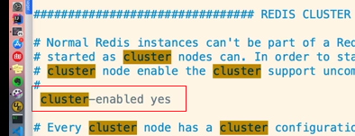

- 每一个节点需要有一个配置文件，每个节点处于集群的角色都需要告知其他所有节点，彼此知道，这个文件用于存储集群模式下的集群状态等信息 ，这个文件是由redis自己维护，不需要人为干预，取消注释即可（如果你要重新创建集群，那么把这个文件删了就行）：

  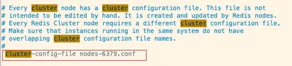

  

- 设置超时时间，单位毫秒，默认15000毫秒，超过这个时间，会认为master挂掉了，从而主从切换：

  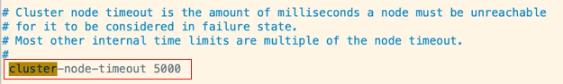

- appendonly保持开启：

  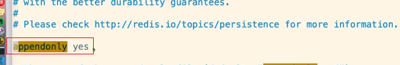

- 删除工作目录下的aof和rdb文件，这两个文件是单机时需要用到的，但在构建集群的时候，必须清空这两个文件，否则会报错：

  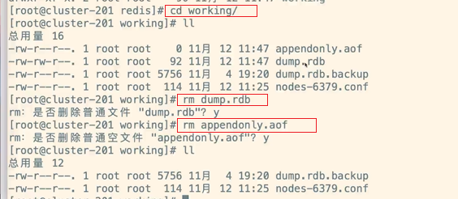

- 重新启动redis，查看当前redis进程：

  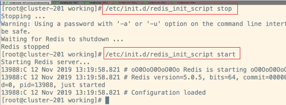

  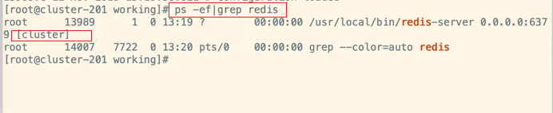

配置完一台节点之后，其他5台节点都进行相同配置。注意：一定要清除working目录下的aof和rdb文件。

## 构建集群

登录201的redis-cli，执行如下命令来构建集群：

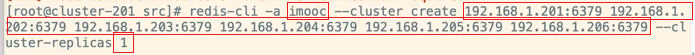

- `-a`：指定当前redis-cli的密码，这里密码是“imooc”。
- `--cluster create`：指定搭建集群的各个节点的IP和端口，这里指定了6个节点。
- `--cliuster-replicas`：指定一个master带有多少个slave，这里设置为1，最终会构建3组主从组成的集群。

构建完成之后的结果：

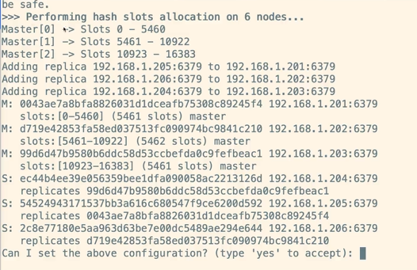

slots：槽，用于装数据，主节点有，从节点没有。

输入“yes”开始构建，构建完成之后，可以输入下述命令在任何一台节点上进行检查：

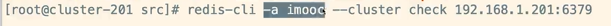

### 集群客户端

通过`redis-cli -c` 可以进入集群控制台。连接到某个Redis节点：

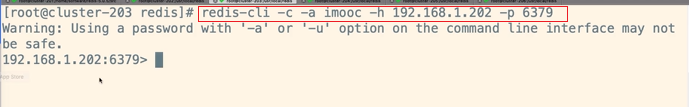

- cluster info 查看该集群信息：

  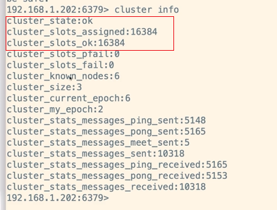

- cluster nodes 查看集群中各节点信息：

  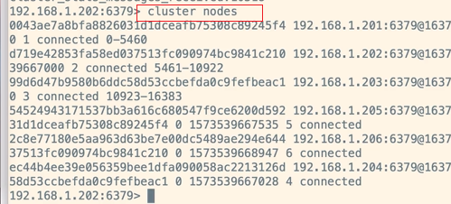

配置完集群之后，使用redis的get命令获取key的值时，redis会自动进行节点切换做mapping取值，而使用keys *查看别的节点的key时，仍然是不能获取到的。

## slots（槽）

数据是保存在slot里的。

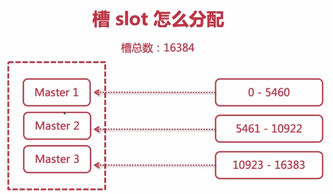

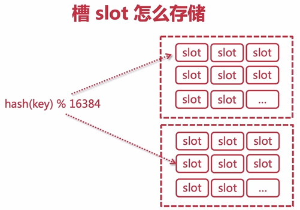