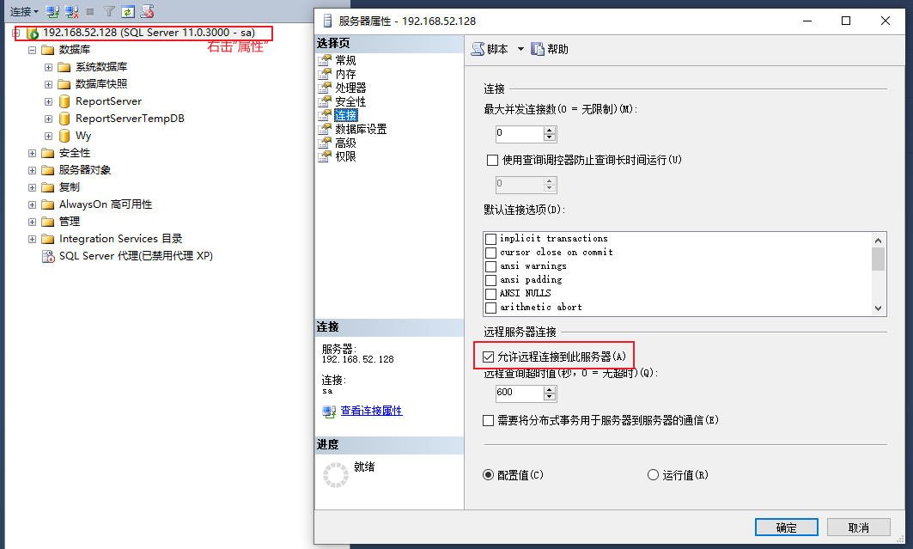
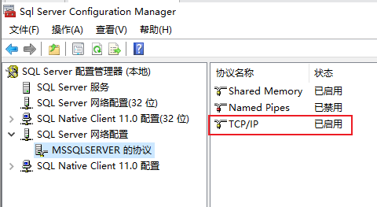

# SQL Server 无法连接解决方式


### 第一步：ping IP

验证数据库服务器IP是否可用，保证本地可以访问远端数据库服务器。

如果不能Ping通，说明网络存在问题。

### 第二步：设置SQL Server允许远程连接访问



### 第三步：设置启用TCP/IP

打开SQL Server配置管理器，启用TCP/IP状态。注意：更改后，需要重新启动SQL Server服务才能生效。



### 第四步：开启数据库服务器1433端口

使用telnet命令验证端口是否启用，在本地机器上执行如下命令：

```
telnet 192.168.52.128 1433
```

如果没有开启，通过防火墙开启1433端口，添加入站出站规则即可。

