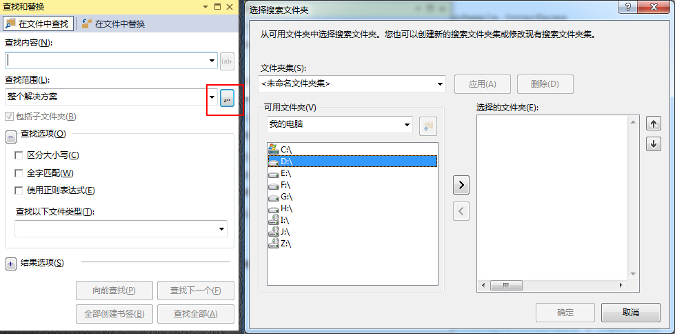
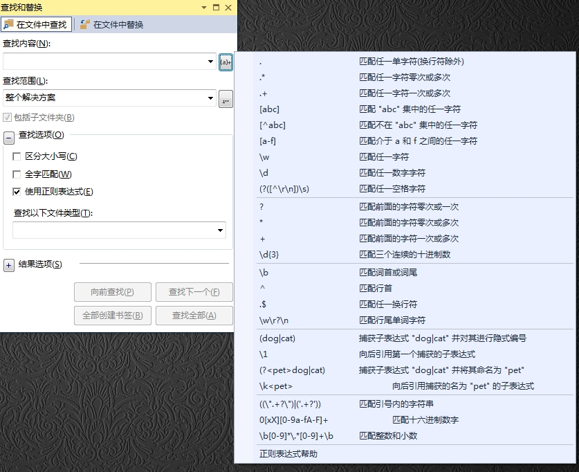
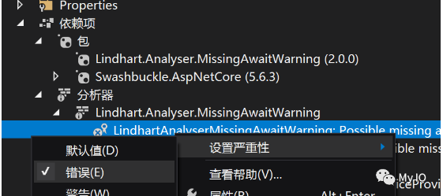
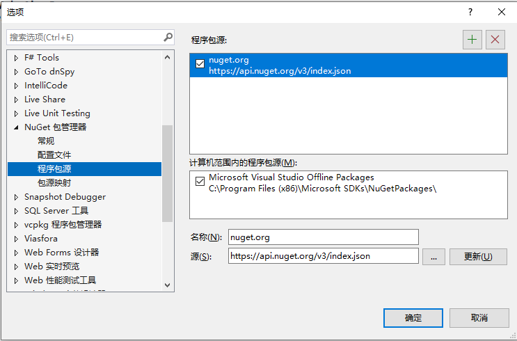

# Visual Studio 使用技巧积累


### 代码窗口的分离（浮动）

一般是直接分割代码窗口，还有一个更好的方式：

```
窗口 => 新建窗口
```


### 切换窗口停靠

当移动VS中的某个窗口时，如果想要恢复窗口之前的停靠位置：

```
Ctrl+双击窗口标题
```

快速将窗口停靠到它之前停靠的位置。


### 复制解决方案窗口

对于大型解决方案，文件数量和文件夹较多，此时使用该功能会非常有用：

```
在解决方案中右击文件夹 => 新建解决方案资源管理器视图
```


### 速览定义

也许你习惯使用【F12】快捷键快速的转向定义，它会重新打开新的文件。可以试试【Alt+F12】的组合，它将在当前代码编辑环境中快速的显示光标所在元素的定义，并且支持编辑，这样的话，就不用打开过多的文件了。


### 开启滚动条的Map模式功能

很多编辑器都提供了Map模式，Visual Studio 2017也一样，只不过默认是关闭的状态。可以通过下述方式进行启动：

```
工具 => 选项 => 文本编辑器 => 所有语言 => 滚动条 => 行为选项中，选择“使用垂直滚动条的缩略图模式”，可以勾选“宣誓预览工具提示”
```

开启了上述功能后，不仅拥有了map模式，而且当鼠标悬停在滚动条上方时，还能够预览该位置的代码片段。


### 巧用在文件中查找实现高级搜索

在文件中查找可以使用快捷键【Ctrl+Shift+F】快速启动，它不仅仅局限于当前解决方案中的文件搜索，而且还可以搜索解决方案之外的文件系统，包括搜索整个文件夹和子文件夹，查找符合搜索条件的文件。



另外，如果你勾选了“使用正则表达式”复选框，当你点击查找内容中的文本框后面的按钮时，将会看到关于如何使用正则表达式的提示，它基于.NET Framework中内置的完整RegEx引擎，能够完成复杂的文本匹配。如果你不记得.net中正则表达式的匹配符，不妨通过该种方式快速查看。




### 在解决方案中同时启动多个项目

有时候，需要同时启动多个项目，比如一个解决方案中包含客户端/服务器应用程序，想要按照先后的顺序同时启动，可以执行如下操作：

```
右击解决方案 => 属性 => “通用属性”下的“启动项目” => 选择“多个启动项目”
```

然后配置要启动的项目，并通过上下箭头控制项目启动的先后顺序。


### 导航到反编译源

最新版的Visual Studio 2017已经提供了反编译源的功能，虽然是试验阶段，但是可以在不安装反编译工具的情况下，直接反编译C#源码，还是很方便的。具体操作如下：

```
工具 => 选项 => 文本编辑器 => C# => 高级 => 选择“启用导航到反编译源(试验)”
```

一旦勾选了上述选项，就可以直接将光标定位到要反编译的C#对象（比如类、方法等）上，按下【F12】键即可导航到反编译源。


### 使用文档大纲视图显式页面元素的层次机构

在使用Visual Studio 2017编辑网页文件时，打开文档大纲视图，可以查看当前文档中所有元素的层次结构。

```
视图 => 其他窗口 => 文档大纲
```


### 快速定位到光标所在的方法定义位置

当光标位于包含了大量代码片段的方法中时，有时候可能需要知道当前光标所在的位置对应的方法，比如，当你查找一个对象，一旦光标位于包含了大量代码片段的方法中，想要查看对应的方法名，只能拖动鼠标进行查看，或者安装VS插件，效率较低，在Visual Studio 2017中提供了一个快速的功能：

```
编辑 => 上一个方法
```

即可快速定位到光标所在位置的对应的方法。


### 基于当前输入的代码智能推荐安装某个包

如果输入了当前没有引用或者未安装的Nuget包对象，可以通过Visual Studio 2017智能推荐功能，建议你安装所需的包或者引入所需的引用，该功能默认是关闭的，因为需要占用大量的内存，可以通过下述方法进行开启：

```
工具 => 选项 => 文本编辑器 => C# => 高级 => 勾选“建议对引用程序集中的类型使用using”和“建议对NuGet包中的类型使用using”选项
```

注：勾选后，可能占用的内存较高，可以根据需要单独设置。


### 多行编辑

1、按住【`Alt`】键，使用鼠标拖拽。（常用）

2、按住【`Alt`+`Shift`】键，然后再按下【上/下/左/右】方向键，来选择多行编辑的区域。

3、按住【`Ctrl`+`Alt`】键，用鼠标点击多个编辑光标进行多行编辑。

4、选中将要编辑的单词，或光标定位到将要编辑的独立的单词上，按下【`Alt`+`Shift`+`;`】键，将会自动匹配并选中所有相同的单词，然后开始编辑。如果不想匹配所有相同的单词，可以按下【`Alt`+`Shift`+`.`】键，一个一个的选择匹配。


### 直接拖动引用项目

在 VS 中的一个项目中引用另一个项目最方便的方法是直接把要引用的项目拖到该项目。


### 在不引用命名空间的情况下显示其他命名空间的成员代码提示

```
工具 => 选项 => 文本编辑器 => c# => IntelliSense => 勾选“显示 unimported 命名空间中的项（试验）”
```


### 调试时加了断点始终不命中断点

删除解决方案下面的.vs目录，重新打开项目。

注意：一定要勾选【启用”仅我的代码“】，否则可能会出现报错不能捕获异常的情况。


### 设置将警告视为错误

生成项目时会看到警告信息，包括警告的编号，如果想要将某个警告设置为错误：

```
打开项目的属性窗口 => 生成面板 => "将警告视为错误" => 在“特定警告”中，填入警告的编号
```


### 执行异步方法时不会遗漏await关键字

方式一：采用将警告视为错误的配置方式。

方式二：引用 Nuget 包 `Lindhart.Analyser.MissingAwaitWarning`，然后，找到对应的分析器，设置“严重性”为“错误”：



再次编译，就会编译失败了。


### Visual Studio 修改NuGet 包缓存路径

Visual Studio 下载的NuGet包默认会缓存到 C:\Users{Windows用户名}.nuget\packages 下，时间一长就会导致 C盘空间严重不足。

设置将包缓存文件保存到其他盘，找到文件`"C:\Program Files (x86)\NuGet\Config\Microsoft.VisualStudio.Offline.config"`，以管理员身份打开并添加如下配置内容：

```
<config>
      <add key="globalPackagesFolder" value="E:\Repository\nuget\packages" />
  </config>
```

最终文件内容如下：

```xml
<?xml version="1.0" encoding="utf-8"?>
<configuration>
  <packageSources>
    <add key="Microsoft Visual Studio Offline Packages" value="C:\Program Files (x86)\Microsoft SDKs\NuGetPackages\"/>
  </packageSources>
  <config>
      <add key="globalPackagesFolder" value="E:\Repository\nuget\packages" />
  </config>
</configuration>
```

保存并退出即可。


### Visual Studio 引入自己的包和DLL

如何在A项目中引入B项目的程序集，有两种方式。

#### 方式一：使用nuget package。

第一步：修改B项目的项目文件，添加Version信息。

```xml
<PropertyGroup>
  <TargetFramework>net7.0</TargetFramework>
  <ImplicitUsings>enable</ImplicitUsings>
  <Nullable>enable</Nullable>
  <Version>1.0.2</Version>
</PropertyGroup>
```

第二步：打包项目程序集。右击项目，选择“打包”。执行完成之后，将在bin/Debug目录下，生成一个.nupkg文件，即为打包文件。

第三步：将.nupkg打包文件放到nuget的程序包源中，或者添加该文件的目录到程序包源中。添加完成之后，可能无法在程序包管理器中搜索到该包，但是可以参照第四步直接在A项目添加引用即可。



第四步：在A项目文件中，添加B项目的程序集引用。

```xml
<PackageReference Include="B项目名" Version="1.0.2" />
```

第五步：还原Nuget包并重新生成项目。

#### 方式二：直接添加项目引用（老的方式）

第一步：右击项目，添加项目引用，选择“浏览”。

第二步：找到B项目的程序集DLL文件，添加即可。

第三步：添加完成之后，将在A项目文件中出现如下内容：

```xml
<ItemGroup>
    <Reference Include="Qubiancheng.Abp.AspNet.JwtBearer">
      <HintPath>..\..\..\Modules\Qubiancheng.Abp.AspNet.JwtBearer\bin\Debug\net7.0\Qubiancheng.Abp.AspNet.JwtBearer.dll</HintPath>
    </Reference>
  </ItemGroup>
```

第四步：重新生成即可。


### XAML的实时可视化树显示完整的节点内容

```
工具 => 选项 => 调试 => XAML热重载 => 去除勾选“仅在实时可视化树启用“仅限我的 XAML””
```

