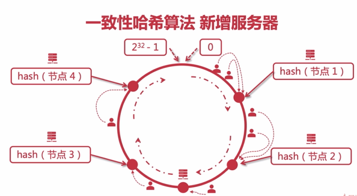
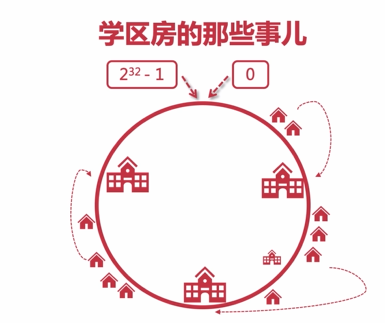

# 面试问题汇总


## C#

### C#，is 和 as

  is主要检查对象类型的兼容性，并返回结果true(false)；不会抛出异常；如果对象为null，刚返回false；

  as检查对象类型的兼容性，并返回转换结果，如果不兼容则返回null；不会抛出异常；如果结果判断为空，则强制执行类型转换将抛出NullReferenceException异常；

### ref 与 out

ref 关键字使参数按引用传递。其效果是，当控制权传递回调用方法时，在方法中对参数的任何更改都将反映在该变量中。若要使用 ref 参数，则方法定义和调用方法都必须显式使用 ref 关键字。

out 关键字会导致参数通过引用来传递。这与 ref 关键字类似，不同之处在于==ref 要求变量必须在传递之前进行初始化==。若要使用 out 参数，方法定义和调用方法都必须显式使用 out 关键字。

（1）ref指定的参数在函数调用时必须先初始化，而out不用

（2）out指定的参数在进入函数时会清空自己，因此必须在函数内部进行初始化赋值操作，而ref不用

总结：ref可以把值传到方法里，也可以把值传到方法外；out只可以把值传到方法外

注意：string作为特殊的引用类型，其操作是与值类型看齐的，若要将方法内对形参赋值后的结果传递

出来，需要加上ref或out关键字。


### .net core 处理全局异常方式

- 基于过滤器，IExceptionFilter
- 基于中间件，自定义异常中间件，通过使用try..catch包裹next()方法，进行补货进行处理。
- 框架自带异常中间件，app.UseExceptionHandler("/Error");


### float转double进度丢失问题

- 先转换为decimal（会存在丢失问题）
- 先转换为字符串，再解析


### C# 堆和栈的区别

 栈：由==编译器自动分配、释放==。==在函数体中定义的变量通常在栈上==。堆：一般由程序员分配释放。用 new、malloc等分配内存函数分配得到的就是在堆上。==存放在栈中时要管存储顺序，保持着先进后出的原则，他是一片连续的内存域，有系统自动分配和维 护==；

  堆：是无序的，他是一片不连续的内存域，==有用户自己来控制和释放，如果用户自己不释放的话，当内 存达到一定的特定值时，通过垃圾回收器(GC)来回收==。==栈内存无需我们管理，也不受GC管理。当栈顶元素使用完毕，立马释放。而堆则需要GC清理==。使用引用类型的时候，一般是对指针进行的操作而非引用类型对象本身。但是值类型则操作其本身


### 请简述await的作用和原理，并说明和GetResult()有什么区别

  从状态机的角度出发，==await的本质是调用Task.GetAwaiter()的UnsafeOnCompleted(Action)回调==，并指定下一个状态号。

  从多线程的角度出发，如果await的Task需要在新的线程上执行，该状态机的MoveNext()方法会立即返回，此时，主线程被释放出来了，然后在UnsafeOnCompleted回调的action指定的线程上下文中继续MoveNext()和下一个状态的代码。

  而相比之下，==GetResult()就是在当前线程上立即等待Task的完成，在Task完成前，当前线程不会释放==。

 == await不会阻塞调用它的线程，而GetAwaiter().GetResult()和.Result则会阻塞调用它的线程，但都会阻塞当前线程==。


### C#中Dispose和 Finalize

C# 内的 Dispose() 和 Finalize() 方法，就是释放对象中非托管资源的方法。

如果你想在自定义的类里面实现 Dispose() 方法，那么就得引用 IDisposable 接口；你可能见过使用 using 的代码，它其实就是try/finally格式的语法糖，在finally内会主动调用 Dispose() 方法，所以当你遇到非托管资源的操作，using是个很安全的做法。当然，你也可以在使用完该对象以后，主动调用它的 Dispose() 方法。

finailze() 是 object 类的内置方法；注意：你查看 object 类源码的时候，并不能查找到 finalize 方法，它是析构方法” ~Object() “编译产生的。如下图，析构方法 ~FinalizeTest() 编译成IL代码以后，就变成了 Finalize()

既然有 Dispose() 方法，为什么还需要 Finalize() 方法呢？因为有时候持有非托管资源的变量可能被用在很多地方，我们无法显示判断在何时调用 Dispose() 方法释放该资源。只有在 GC 的时候，我们判断引用该非托管资源的变量已经不被任何其他对象引用，这时候才是合适的释放时机。然而GC过程是内部实现的，我们无法在 GC 过程中手动调用 Dispose() 方法，所以 Finalize() 方法的用处就来了，GC 会自动调用 Finalize() 方法，我们只要把释放非托管内存的代码写在 Finalize() 方法中，就能释放非托管内存了

那么 Finalize() 是怎么被调用的呢？当程序运行以后，GC会收集实现了 Finalize() 方法的对象，并把他们放入一个队列。当某个对象可以释放内存的时候：GC会把它所持有的非托管内存释放，并从队列中移除；但请注意，该对象在托管堆中并未释放。只有在下一次 GC 的时候，才会从托管堆中释放该对象

### `==` 和 equals

差别主要在引用类型的比较上， 对于引用类型来说，等号(==)比较的是两个变量的”引用” 是否一样，即是引用的”地址”是否相同。而对于equals来说仍然比较的是变量的 ”内容” 是否一样。

对于值类型来说 两者比较的都是”内容”是否相同，即 值 是否一样，很显然此时两者是划等号的。

对于string类型来说，由于string是微软封装的一个字符串类，在内部他已经对 = = 操作符进行了重写。重写后他比较的则是两个变量的内容是否相同。


### const 和 readonly

const，常量，编译期进行初始化，所以定义常量需要指定初始值。

readonly，运行期初始化，可以在构造函数中初始化。


### Enumerable<T>的GroupJoin方法和Join的用法和区别

  GroupJoin和Join方法是Linq中常用的联合查询方法，他们区别是：

  Join通常相当于SQL中的内连接inner join

  GroupJoin相当于SQL中的左连接left join


### Linq中.AsEnumerable(), AsQueryable() ,.ToList(),的区别和用法

**AsEnumerable（）**

  加载每个记录到应用程序内存，然后处理/过滤。==迭代时遇到 AsEnumerable() 会先进行 sql 查询,== 所以对已查出来的结果当然能进行 Linq to object 操作。（例如在/select/top，它会SELECT * FROM table1，在存储器中，然后select top第一个元素）（在这种情况下，它的所作所为：LINQ到SQL + LINQ到对象）

**AsQueryable（）**

  转换成表达T-SQL（与特定提供商mysql），查询和远程加载结果到应用程序的内存。==`AsQueryable()`. 语句执行后不会立刻查询数据库, 而是在迭代使用table1 时才会查数据库==。

这就是为什么DbSet（实体框架）也继承的IQueryable获得高效的查询。

不要装入每个记录，例如，如果查询5条记录，它会在后台生成SELECT TOP 5 * SQL，==AsQueryable()通常工作速度远远高于AsEnumerable()，因为它首先生成T-SQL，其中包括在你的LINQ的所有where条件==。

**ToList（）**

立即查询，跟前面两个属性是对立的，一般获取最终结果使用。


### Sealed、new、virtual、abstract、override关键字？

**1、sealed**

密封类不能被继承，密封方法可以重写基类中的方法，但其本身不能在任何派生类（子类）中进一步重写。当应用于属性或者方法时，sealed 修饰符必须始终和override一同使用。

通俗的说：密封类不会有子类。

**2、new**

new关键字用于显式隐藏从基类继承的成员。在使用子类时调用的方法是new关键字新定义的方法，而不是基类（父类）的方法。

**3、virtual**

virtual 关键字用于修改方法或者属性的声明，此时，方法或者属性被称为虚成员，虚成员的实现可以由派生类（子类）中的重写成员更改。

在调用虚方法时，将为重写成员检查该对象的运行时类型。将调用大部分派生类（子类）中的该重写成员，如果没有派生类（子类）重写该成员，则它可能是原始成员。

**4、abstract**

抽象类 abstract可以修饰 类、 方法、属性、索引器、事件。

在类中使用abstract修饰符，表示该类只能是其他类的基类（父类）。标记为抽象或者包含抽象类中的成员必须通过从抽象类派生类（子类）来实现。

抽象类特征：

1、抽象类不能进行实例化

2、抽象类可以包含抽象方法和抽象访问器

3、不能用sealed修饰符修改抽象类，它俩可以理解为互逆的关系。

4、从抽象类派生的非抽象类必须包含继承的所有抽象方法和抽象访问器的实现。

5、在方法或属性声明中使用abstract修饰符表示该方法或者属性不包含实现。

抽象方法的特性：

1、抽象方法是隐式的virtual方法。

2、只允许在抽象类中声明抽象方法。

3、抽象方法不提供实际的实现，例如：public abstract void play();

4、实现由overriding 方法提供，它是非抽象的成员。

5、抽象方法不能使用 static或 virtual修饰符。

6、在静态属性上使用abstract修饰符是错误的。

7、在派生类（子类），通过使用override修饰符的属性声明可以重写抽象的继承属性。

**5、override**

使用override修饰符来修改方法、属性、索引器或者事件，主要是提供派生类对基类方法的新实现。从而覆盖abstract、virtual两种关键字修饰的成员。

由重写声明重写的方法称为重写基方法。重写基方法必须与重写方法具有相同的签名。

说明：

1、重写基方法必须虚拟的、抽象的或者重写的，不能重写非虚方法或者静态方法。

2、不能使用 new static、virtual和abstract修饰符修改重写方法。

3、重写属性声明必须指定与继承属性完全相同的访问修饰符、类型和名称，并且

重写属性必须是虚拟的、抽象的或者重写的。


 


## ASP.NET

### ASP.NET CORE日志级别

1.Trace

最详细的日志，可能包含敏感信息，所以不建议使用在生产环境。

2.Debug

这种消息在开发阶段短期有用，包含一些可能对调试有用，但没有长期价值的信息。

3.Information

具有长期价值，用于追踪程序的一般流程。

4.Warning

出现错误或不会使程序中断的异常，使用该级别可以供日后调查。

5.Error

应用程序因故障停止工作，记录错误日志，应当指明具体操作或活动。

6.Critical

灾难性故障，需要立即关注，如数据丢失、磁盘空间不足。

### 依赖注入服务生命周期

依赖注入服务有3种生命周期：Transient；Scoped；Singleton

Transient：即用即建，用后即弃。就是每次获取这个服务的实例时都要创建一个这个服务的实例。

Scoped：这种类型的服务实例保存在当前依赖注入容器(IServiceProvider)上。在同作用域,服务每个请求只创建一次。（同一个请求，相同结果，刷新页面后，会变化）

Singleton：单例。即只保存一个服务实例

### ASP.NET Core Filter 如何支持依赖注入？

可以通过全局注册，支持依赖注入。通过TypeFilter(typeof(Filter)) 标记在方法，标记在控制器。通过ServiceType(typeof(Filter))标记在方法，标记在控制器，必须要注册Filter这类；==TypeFilter和ServiceType的本质是实现了一个IFilterFactory接口==。


### ASP.NET Core 过滤器

- 异常过滤器，IExceptionFilter
- 


### gRPC 有那四种服务类型

分别是：简单 RPC（Unary RPC）、服务端流式 RPC （Server streaming RPC）、客户端流式 RPC （Client streaming RPC）、双向流式 RPC（Bi-directional streaming RPC）


## EF Core

### EF Core DbContext的生存期

`DbContext` 的生存期从创建实例时开始，并在释放实例时结束。 `DbContext` 实例旨在用于单个工作单元。这意味着 `DbContext` 实例的生存期通常很短。

生存周期工作单元如下：

- 创建 `DbContext` 实例

- 根据上下文跟踪实体实例。

  实体将在以下情况下被跟踪

- - 正在从查询返回
  - 正在添加或附加到上下文

- 根据需要对所跟踪的实体进行更改以实现业务规则

- 调用 SaveChanges 或 SaveChangesAsync。

  EF Core 检测所做的更改，并将这些更改写入数据库。

- 释放 `DbContext` 实例


## Redis

### Redis 的回收策略（淘汰策略） ?
volatile-lru： 从已设置过期时间的数据集（ server.db[i].expires）中挑选最近最少使用的数据淘汰
volatile-ttl： 从已设置过期时间的数据集（ server.db[i].expires）中挑选将要过期的数据淘汰
volatile-random： 从已设置过期时间的数据集（ server.db[i].expires）中任意选择数据淘汰
allkeys-lru： 从数据集（ server.db[i].dict） 中挑选最近最少使用的数据淘汰
allkeys-random： 从数据集（ server.db[i].dict）中任意选择数据淘汰  no-enviction（驱逐）： 禁止驱逐数据
注意这里的 6 种机制， volatile 和 allkeys 规定了是对已设置过期时间的数据集淘汰数据还是从全部数据集淘汰数据，后面的 lru、 ttl 以及 random 是三种不同的淘汰策略，再加上一种 no-enviction 永不回收的策略。

使用策略规则：
如果数据呈现幂律分布，也就是一部分数据访问频率高，一部分数据访问频率低，则使用 allkeys-lr 

如果数据呈现平等分布，也就是所有的数据访问频率都相同，则使用allkeys-random  .


### Redis 的同步机制了解么？
Redis 可以使用主从同步，从从同步。第一次同步时，主节点做一次 bgsave，
并同时将后续修改操作记录到内存 buffer，待完成后将 rdb 文件全 量同步到
复制节点，复制节点接受完成后将 rdb 镜像加载到内存。加载完成 后，再通
知主节点将期间修改的操作记录同步到复制节点进行重放就完成了同步过程。  

### 是否使用过 Redis 集群，集群的原理是什么？
⚫ Redis Sentinal 着眼于高可用，在 master 宕机时会自动将 slave 提升
为 master，继续提供服务。
⚫ Redis Cluster 着眼于扩展性，在单个 redis 内存不足时，使用 Cluster
进行分片存储。  

### 说说 Redis 哈希槽的概念？
Redis 集群没有使用一致性 hash,而是引入了哈希槽的概念， Redis 集群 有
16384 个哈希槽，每个 key 通过 CRC16 校验后对 16384 取模来决定放置 哪
个槽，集群的每个节点负责一部分 hash 槽。  

### Redis key 的过期时间和永久有效分别怎么设置？

expire 和persist命令。

### Redis 如何做内存优化？
尽可能使用散列表（ hashes），散列表（是说散列表里面存储的数少）使用的
内存非常小，所以你应该尽可能的将你的数据模型抽象到一个散列表里面。比
如你的 web 系统中有一个用户对象，不要为这个用户的名称，姓氏，邮箱，密
码设置单独的 key,而是应该把这个用户的所有信息存储到一张散列表里面  

### Redis 提供 6 种数据淘汰策略：
volatile-lru： 从已设置过期时间的数据集（ server.db[i].expires）中挑选
最近最少使用的数据淘汰
volatile-ttl： 从已设置过期时间的数据集（ server.db[i].expires）中挑选
将要过期的数据淘汰
volatile-random： 从已设置过期时间的数据集（ server.db[i].expires）中任
意选择数据淘汰
allkeys-lru： 从数据集（ server.db[i].dict）中挑选最近最少使用的数据淘
汰
allkeys-random： 从数据集（ server.db[i].dict）中任意选择数据淘汰
no-enviction（驱逐） ：禁止驱逐数据  


## 开放性题目

### 对于 Web 性能优化，您有哪些了解和经验吗？

分前端（css、JavaScript（单页程序）)、后端（程序、数据库、nginx）、架构设计（前后端分离）三个层面来说


### 简述一下BIO/NIO/AIO之间的概念与区别

阻塞与非阻塞：是相对于服务端来说的；

同步与异步：是相对于客户端来说的；同步是客户端自己去等待响应，异步是服务端有响应后，通知客户端再去处理；

#### 同步阻塞（BIO）

 客户端发送请求给服务端，此时服务端处理任务时间很久，则**客户端则被服务端堵塞了，所以客户端会一直等待服务端的响应，此时客户端不能做其他任何事，服务端也不会接受其他客户端的请求**。这种通信机制比较简单粗暴，但是效率不高。

【客户端不做任何事，一直等待服务端，服务端也不接受其他客户端请求】

#### 同步非阻塞（NIO）

 客户端发送请求给服务端，此时服务端处理任务时间很久，这个时候**虽然客户端会一直等待响应，但是服务端可以处理其他的请求，过一会回来处理原先的**。这种方式很高效，一个服务端可以处理很多请求，不会在因为任务没有处理完而堵着，所以这是非阻塞的。

【客户端不做任何事，一直等待服务端，服务端仍然接受其他客户端请求】

#### 异步阻塞

 客户端发送请求给服务端，此时**服务端处理任务时间很久，但是客户端不会等待服务器响应，它可以做其他的任务**，等服务器处理完毕后再把结果响应给客户端，客户端得到回调后再处理服务端的响应。这种方式可以避免客户端一直处于等待的状态，优化了用户体验，其实就是类似于网页里发起的ajax异步请求。

【服务端长时间处理当前任务，不去处理其他任务；客户端不用等服务器响应，可以做其他任务，等到服务端将结果通知客户端，客户端得到回调后再处理响应】

#### 异步非阻塞（AIO）

 客户端发送请求给服务端，此时服务端处理任务时间很久，这个时候的任务虽然处理时间会很久，但是客户端可以做其他的任务，因为他是异步的，可以在回调函数里处理响应；同时服务端是非阻塞的，所以服务端可以去处理其他的任务，如此，这个模式就显得非常的高效了。

【服务端虽然需要长时间处理，但仍然可以去处理其他任务；客户端也不用等待服务器响应，也可以做其他任务】


## 数据库

### 据库三大范式是什么
⚫ 第一范式：每个列都不可以再拆分。
⚫ 第二范式：在第一范式的基础上，非主键列完全依赖于主键，而不能是依
赖于主键的一部分。
⚫ 第三范式：在第二范式的基础上，非主键列只依赖于主键，不依赖于其他
非主键。


  


### Mysql 事务隔离

参考链接：

- [03 | 事务隔离：为什么你改了我还看不见？ (geekbang.org)](https://time.geekbang.org/column/article/68963)
- [15丨初识事务隔离：隔离的级别有哪些，它们都解决了哪些异常问题？ (geekbang.org)](https://time.geekbang.org/column/article/107401)
- [第36讲 | 谈谈MySQL支持的事务隔离级别，以及悲观锁和乐观锁的原理和应用场景？ (geekbang.org)](https://time.geekbang.org/column/article/12288)


### MySQL 的 Binlog 有有几种录入格式？分别有什么区别？
有三种格式， statement， row 和 mixed。
⚫ statement 模式下，每一条会修改数据的 sql 都会记录在 binlog 中。不需
要记录每一行的变化，减少了 binlog 日志量，节约了 IO，提高性能。由于
sql 的执行是有上下文的，因此在保存的时候需要保存相关的信息，同时还
有一些使用了函数之类的语句无法被记录复制。
⚫ row 级别下，不记录 sql 语句上下文相关信息，仅保存哪条记录被修改。记
录单元为每一行的改动，基本是可以全部记下来但是由于很多操作，会导
致大量行的改动(比如 alter table)，因此这种模式的文件保存的信息太
多，日志量太大。
⚫ mixed，一种折中的方案，普通操作使用 statement 记录，当无法使用
statement 的时候使用 row。  


### MySQL 存储引擎 MyISAM 与 InnoDB 区别  

InnoDB 比 MyISAM 支持更高的并发;InnoDB
的锁粒度为行锁、 MyISAM 的锁粒度为表锁、行锁需要对每一行进行加锁，
74
所以锁的开销更大，但是能解决脏读和不可重复读的问题，相对来说也更
容易发生死锁  

由于 InnoDB 是有事务日志的，所以在产生由于数据库崩溃等
条件后，可以根据日志文件进行恢复。而 MyISAM 则没有事务日志。  

表结构文件上:MyISAM 的表结构文件包括:frm(表结构定义),.MYI(索
引),.MYD(数据);而 InnoDB 的表数据文件为:ibd 和 frm(表结构定义)  。


### MyISAM 索引与 InnoDB 索引的区别  

InnoDB 索引是聚簇索引， MyISAM 索引是非聚簇索引。
⚫ InnoDB 的主键索引的叶子节点存储着行数据，因此主键索引非常高效。
⚫ MyISAM 索引的叶子节点存储的是行数据地址，需要再寻址一次才能得到数
据。
⚫ InnoDB 非主键索引的叶子节点存储的是主键和其他带索引的列数据，因此
查询时做到覆盖索引会非常高效  


### 什么是索引

索引是一种特殊的文件(InnoDB 数据表上的索引是表空间的一个组成部分)，它
们包含着对数据表里所有记录的引用指针。
索引是一种数据结构。数据库索引，是数据库管理系统中一个排序的数据结
构，以协助快速查询、更新数据库表中数据。索引的实现通常使用 B 树及其变
种 B+树。
更通俗的说，索引就相当于目录。为了方便查找书中的内容，通过对内容建立
索引形成目录。索引是一个文件，它是要占据物理空间的。  


### MySQL 中有哪几种锁？  

表级锁：开销小，加锁快；不会出现死锁；锁定粒度大，发生锁冲突的概
率最高，并发度最低。
⚫ 行级锁：开销大，加锁慢；会出现死锁；锁定粒度最小，发生锁冲突的概
率最低，并发度也最高。
⚫ 页面锁：开销和加锁时间界于表锁和行锁之间；会出现死锁；锁定粒度界
于表锁和行锁之间，并发度一般。  


### 什么是最左前缀原则？什么是最左匹配原则  


顾名思义，就是最左优先，在创建多列索引时，要根据业务需求， where 子句
中使用最频繁的一列放在最左边。  

最左前缀匹配原则，非常重要的原则， mysql 会一直向右匹配直到遇到范围查
询(>、 <、 between、 like)就停止匹配，比如 a = 1 and b = 2 and c > 3 and
d = 4 如果建立(a,b,c,d)顺序的索引， d 是用不到索引的，如果建立
(a,b,d,c)的索引则都可以用到， a,b,d 的顺序可以任意调整。
=和 in 可以乱序，比如 a = 1 and b = 2 and c = 3 建立(a,b,c)索引可以任
意顺序， mysql 的查询优化器会帮你优化成索引可以识别的形式。  


### 谈谈 SQL 优化的经验  

查询语句无论是使用哪种判断条件等于、小于、大于， WHERE 左侧的条件
查询字段不要使用函数或者表达式
83
⚫ 使用 EXPLAIN 命令优化你的 SELECT 查询，对于复杂、效率低的 sql 语
句，我们通常是使用 explainsql 来分析这条 sql 语句，这样方便我们分
析，进行优化。
⚫ 当你的 SELECT 查询语句只需要使用一条记录时，要使用 LIMIT 1。不要
直接使用 SELECT*，而应该使用具体需要查询的表字段，因为使用 EXPLAIN
进行分析时， SELECT"使用的是全表扫描，也就是 type =all 。
⚫ 为每一张表设置一个 ID 属性。
⚫ 避免在 MHERE 字句中对字段进行 NULL
⚫ 判断避免在 WHERE 中使用!或>操作符
⚫ 使用 BETWEEN AND 替代 IN
⚫ 为搜索字段创建索引
⚫ 选择正确的存储引擎， InnoDB、 MyISAM、 MEMORY 等
⚫ 使用 LIKE%abc%不会走索引，而使用 LIKE abc%会走索引。
⚫ 对于枚举类型的字段(即有固定罗列值的字段)，建议使用 ENUM 而不是
VARCHAR，如性别、星期、类型、类别等。
⚫ 拆分大的 DELETE 或 INSERT 语句
⚫ 选择合适的字段类型，选择标准是尽可能小、尽可能定长、尽可能使用整
数。
⚫ 字段设计尽可能使用 NOT NULL
⚫ 进行水平切割或者垂直分割  


## 消息队列

### 什么是 Producer、 Consumer、 Broker、 Topic、
Partition？
Kafka 将生产者发布的消息发送到 Topic（主题） 中，需要这些消息的消费
者可以订阅这些 Topic（主题）。 Kafka 比较重要的几个概念：
⚫ Producer（生产者） : 产生消息的一方。
⚫ Consumer（消费者） : 消费消息的一方。
⚫ Broker（代理） : 可以看作是一个独立的 Kafka 实例。多个 Kafka
Broker 组成一个 Kafka Cluster。
⚫ Topic（主题） : Producer 将消息发送到特定的主题， Consumer 通过订
阅特定的 Topic(主题) 来消费消息。
⚫ Partition（分区） : Partition 属于 Topic 的一部分。一个 Topic 可
以有多个 Partition ，并且同一 Topic 下的 Partition 可以分布在不同
的 Broker 上，这也就表明一个 Topic 可以横跨多个 Broker 。这正如我
上面所画的图一样


## 分布式

### CAP 理论的理解  

在理论计算机科学中， CAP 定理（ CAP theorem），又被称作布鲁尔定理
（ Brewer’s theorem），它指出对于一个分布式计算系统来说，不可能同时满
足以下三点：
⚫ Consistency（一致性） 指数据在多个副本之间能够保持一致的特性
（严格的一致性）
⚫ Availability（可用性） 指系统提供的服务必须一直处于可用的状态，
每次请求都能获取到非错的响应（不保证获取的数据为最新数据）
128
⚫ Partition tolerance（分区容错性） 分布式系统在遇到任何网络分区故
障的时候，仍然能够对外提供满足一致性和可用性的服务，除非整个网络
环境都发生了故障。

当发生网络分区的时候，如果我们要继续服务，那么强一致性和可用性只能 2
选 1。也就是说当网络分区之后 P 是前提，决定了 P 之后才有 C 和 A 的选择。
也就是说分区容错性（ Partition tolerance）我们是必须要实现的。  


## ABP与DDD

[ABP(现代ASP.NET样板开发框架)系列之3、ABP分层架构 - 阳光铭睿 - 博客园 (cnblogs.com)](https://www.cnblogs.com/mienreal/p/4534598.html)


## 算法

### C# 利用IEnumerable<T>实现斐波那契数列生成

[进大厂面试必备：各类排序算法总结.(c#) (qq.com)](https://mp.weixin.qq.com/s?__biz=MzI2NDE1MDE1MQ==&mid=2650838523&idx=1&sn=ede86249062c96447063c8d416732f5e&chksm=f1453813c632b105d30f35ed2c7e2307f9fd22eecdfc5343415817d401c3b1565869ff8bed9a&scene=178&cur_album_id=1911268413029580801#rd)

本题主要考点是yield，对yield的使用熟练程度，另外也考到了斐波那契数列的数学知识及实现他的算法。

方法一（推荐）直接应用linq的Take调用,不用传参数。：

```
//实现
  static IEnumerable<int> Fibs()
        {
           var (x, y) = (1, 1);
            yield return x;
            yield return y;
            while(true)
            {
                (x, y) = (y, x + y);
                yield return y;
            }
        }
        //调用
      foreach (var item in Fibs().Take(10))
            {
                Console.WriteLine(item.ToString());
            }
            Console.ReadLine();
```

方法二：

```

//实现
static IEnumerable<int> GenerateFibonacci(int n)
        {
            int current = 1, next = 1;
            for (int i = 0; i < n; ++i)
            {
                yield return current;
                next = current + (current = next);
            }
        }
    //调用
   foreach (var item in GenerateFibonacci(10))
            {
                Console.WriteLine(item.ToString());
            }
            Console.ReadLine();
```


### 普通斐波那契数列，**1，1，2，3，5，........求第30个数.**

```

public static int Foo(int i)
      {
  if (i <= 0)
    return 0;
  else if (i > 0 && i <= 2)
    return 1;
  else
    return  Foo(i - 1) + Foo(i - 2);
      }
```

### 阶乘

```
public int jiecheng(int n)
 {
  if (n == 1)
    return 1;
  else if (n == 2)
    return 2;
  else
    return n * jiecheng(n - 1);
 }
```


### 各种排序算法

冒泡排序:

```csharp
 public void BubbleSort(int[] arr)
     {
            int temp=0;
          //需要走arr.Length-1 趟
           for(int i=0;i<arr.Length-1;i++)
           {
                 //每一趟需要比较次数
                 for(int j=0,j<arr.Length-i-1;j++)
                 {
                     //升序排序
                      if(arr[j]>arr[j+1])
                      {
                               temp=arr[j];//将较大的变量保存在临时变量
                               arr[j]=arr[j+1]；
                               arr[j+1]=temp;
                       }
                 }
            }
         
     }
```

直接插入排序：

```csharp
public void InsertionSort(int[] arr)
      {
             int temp=0;
             //遍历待插入的数(从第二位开始)
             for(int i=1;i<arr.Length;i++)
             {
　　　　　　　　　　　　temp=arr[i];//待插入的数
　　　　　　　　　　　　int j=i-1;//（j为已排序的待插入的位置序号）
                     
                     //若已排序的数大于待插入数，则往后移一位
                     while(j>=0&&arr[j]>temp)
                     {
                            arr[j+1]=arr[j];
                            j--;
                      }
                     arr[j+1]=temp;//将待插入的数放入插入位置
              }
      }
```

选择排序：

```csharp


public void SelectionSort(int[] arr)
     {
         int temp;
         for(int i=0;i<arr.Length-1;i++)
         {
             int minVal=arr[i];
             int minIndex=i;
             for(int j=i+1;j<arr.Length;j++)
             {
                 if(minVal>arr[j])
                 {
                    minVal=arr[j];
                    minIndex=j;
                 }
             }
             temp=arr[i];
             arr[i]=minVal;
             arr[minIndex]=temp;
         }
 
     }
}
```


### 


### hash算法和hash一致性算法

[2-24 一致性hash算法-慕课网体系课 (imooc.com)](https://class.imooc.com/lesson/1227#mid=28710)

hash一致性算法的原理：就近原则。



新增加一个节点，或移除一个节点，能够保证其他节点不受影响。

举例：学区房

